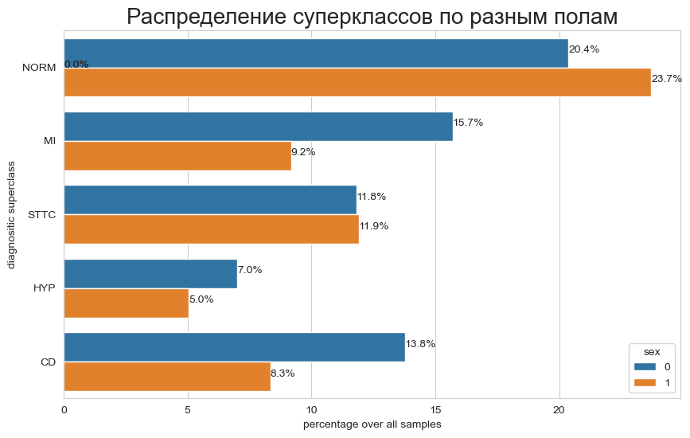

# Анализ датасета метаданных ptbxl_database.csv

Выводы были сделаны по анализу файла с метаданными ptbxl_database.csv
Всего наблюдей 21799. Некоторые колонки имеют пустые значения, но для реализации модели они не оказывают какого-то
значимого влияния.
Данные сигналов (ссылки на файлы) не содержат пропуски и целевая переменная (scp_codes и подкалссы) тоже не содержит
пропуски.

Есть выбросы в колонке age (возраст). Они были удалены по условию age > 100. В принципе пациентов с возрастом более 100
лет встречаются редко. После удаления получили следующее описание.
Index: 21501 entries, 1 to 21837
Data columns (total 28 columns):

| #  | Column                       | Non-Null | Count    | Dtype   |  
|----|------------------------------|----------|----------|---------|  
| 0  | patient_id                   | 21501    | non-null | float64 |
| 1  | age                          | 21501    | non-null | float64 |
| 2  | sex                          | 21501    | non-null | int64   |
| 3  | height                       | 6812     | non-null | float64 |
| 4  | weight                       | 9263     | non-null | float64 |
| 5  | nurse                        | 20056    | non-null | float64 |
| 6  | site                         | 21486    | non-null | float64 |
| 7  | device                       | 21501    | non-null | object  |
| 8  | recording_date               | 21501    | non-null | object  |
| 9  | report                       | 21501    | non-null | object  |
| 10 | scp_codes                    | 21501    | non-null | object  |
| 11 | heart_axis                   | 13167    | non-null | object  |
| 12 | infarction_stadium1          | 5489     | non-null | object  |
| 13 | infarction_stadium2          | 100      | non-null | object  |
| 14 | validated_by                 | 12136    | non-null | float64 |
| 15 | second_opinion               | 21501    | non-null | bool    |
| 16 | initial_autogenerated_report | 21501    | non-null | bool    |
| 17 | validated_by_human           | 21501    | non-null | bool    |
| 18 | baseline_drift               | 1570     | non-null | object  |
| 19 | static_noise                 | 3215     | non-null | object  |
| 20 | burst_noise                  | 603      | non-null | object  |
| 21 | electrodes_problems          | 29       | non-null | object  |
| 22 | extra_beats                  | 1898     | non-null | object  |
| 23 | pacemaker                    | 283      | non-null | object  |
| 24 | strat_fold                   | 21501    | non-null | int64   |
| 25 | filename_lr                  | 21501    | non-null | object  |
| 26 | filename_hr                  | 21501    | non-null | object  |
| 27 | scp_superclass               | 21501    | non-null | object  |

Количество семплов уменьшилось незначительно до 21501.

Словарь с кодами диагнозов не имеет пропусков в колонках обозначающих коды и сабкоды диагнозов
Index: 44 entries, NDT to 2AVB
Data columns (total 12 columns):

| #  | Column                                         | Non-Null | Count    | Dtype   |
|----|------------------------------------------------|----------|----------|---------|  
| 0  | description                                    | 44       | non-null | object  |
| 1  | diagnostic                                     | 44       | non-null | float64 |
| 2  | form                                           | 4        | non-null | float64 |
| 3  | rhythm                                         | 0        | non-null | float64 |
| 4  | diagnostic_class (диагностический класс)       | 44       | non-null | object  |
| 5  | diagnostic_subclass (диагностический подкласс) | 44       | non-null | object  |
| 6  | Statement Category                             | 44       | non-null | object  |
| 7  | SCP-ECG Statement Description                  | 44       | non-null | object  |
| 8  | AHA code                                       | 22       | non-null | float64 |
| 9  | aECG REFID                                     | 12       | non-null | object  |
| 10 | CDISC Code                                     | 13       | non-null | object  |
| 11 | DICOM Code                                     | 9        | non-null | object  |

Чаще всего встречается записи содержащие 1 класс и 1 подкласс диагноза.
44% семплов - нормальное состояние, на втором месте идет инфракт миакарда - 25%, STTC - 23%, гипертония - 12%, CD - 22%

Распределение подклассов диагнозов

Пик нормального состояния приходится примерно на 50 лет.
После он начинает уменьшаться. Пик категории MI (инфаркт миакарда), HYP (Гипертония), CD (Нарушение сердечной
проводимости), STTC (изменение ST сегмента) приходится на 65 лет.

В распределенгии диагнозов по росту и весу нет выбросов. Видна нормальная кривая.

На графике зависимости диагнозов от пола картинка уже интереснее

В наборе больше семплов мужского пола с инфарктом, соответственно нормальное состояние чаще встречается у женщина.

Диаграмма коррелации имеет вид

TOP-10 пар признаков упорядоченных по убыванию коррелации

| Класс   | подкласс      | кк        |
|---------|---------------|-----------|
| HYP     | sub_LVH       | 0.885565  |
| MI      | sub_IMI       | 0.728989  |
| MI      | sub_AMI       | 0.697662  |
| sub_LVH | sub_ISC_      | 0.687792  |
| HYP     | sub_ISC_      | 0.610587  |
| STTC    | sub_STTC      | 0.603370  |
| sex     | height        | -0.576090 |
| CD      | sub_LAFB/LPFB | 0.555745  |
| height  | weight        | 0.544532  |
| MI      | sub_NORM      | -0.510714 |
| NORM    | STTC          | -0.487825 |
| STTC    | sub_NORM      | -0.487825 |
| STTC    | sub_ISC_      | 0.443317  |
| sex     | weight        | -0.435627 |
| CD      | sub_IRBBB     | 0.435078  |
| age     | sub_NORM      | -0.396664 |
| age     | NORM          | -0.396664 |
| HYP     | sub_LAO/LAE   | 0.379847  |

Построение хитмапы осуществлялось по датафрейму с новыми признаками

В принципе здесь видно, что подклассы коррелируют с их суперклассами.
Так же гипертония HYP имеет заметную корреляцию с подклассом ишемии ISC.
Это соотетсвует тому, что артериальная гипертония является причиной ишемических лакунарных инфарктов (известный факт).
В исходном наборе данных есть колонки большим количеством пропусков

Но эти колонки скорее всего не будут в дальнейшем использоваться для построения модели по анализу ЭКГ.
