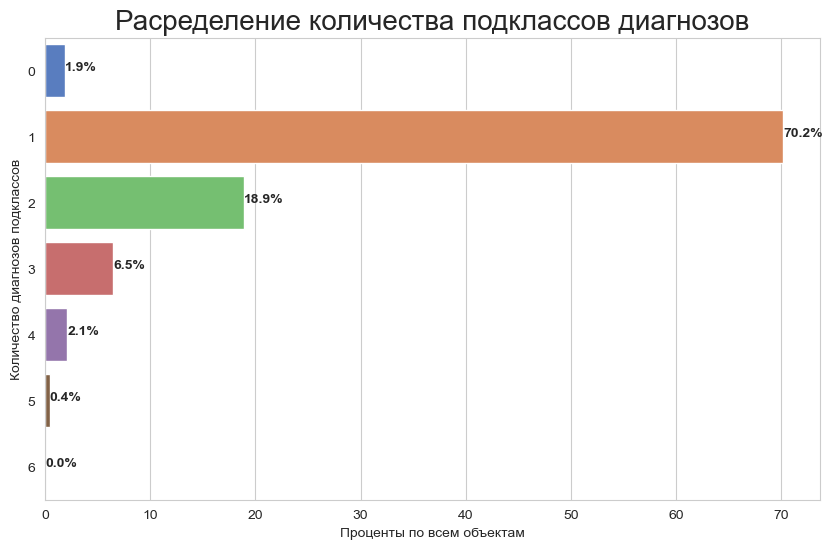
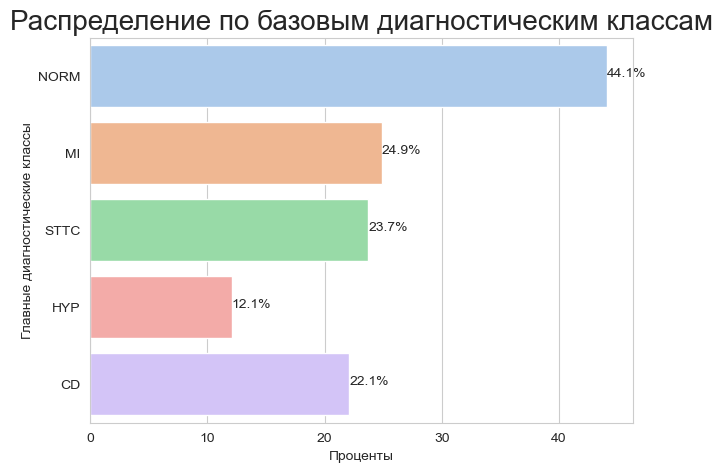
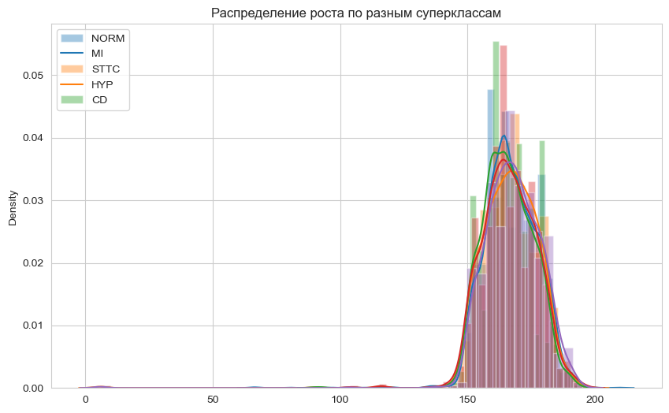
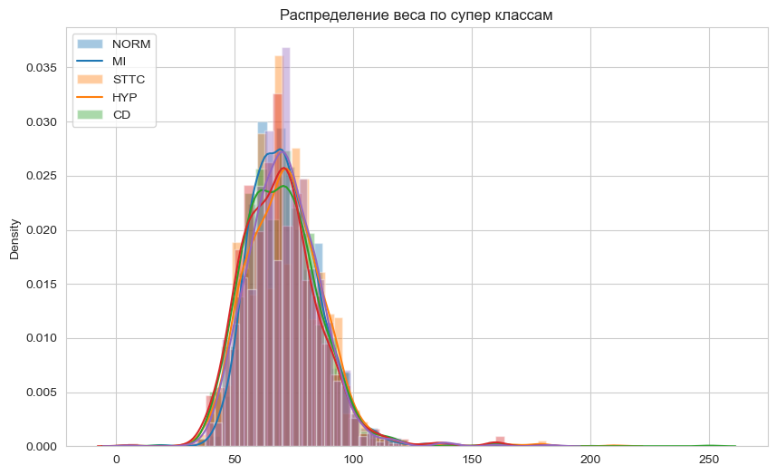
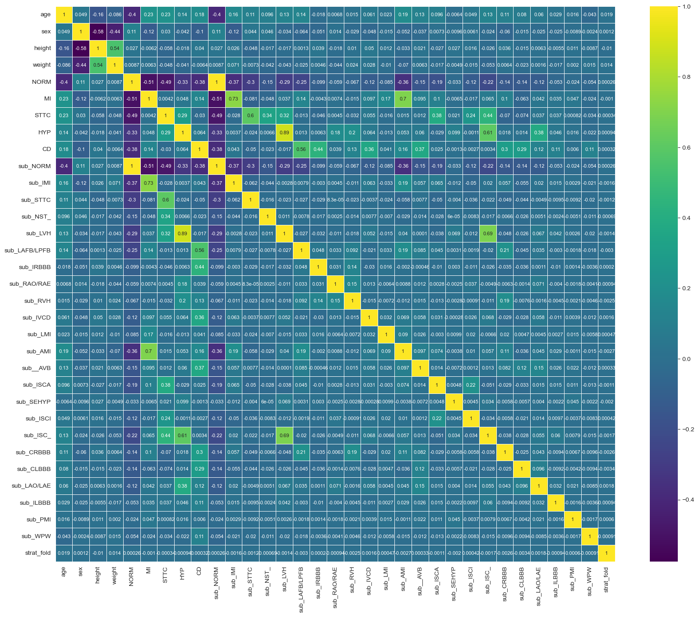
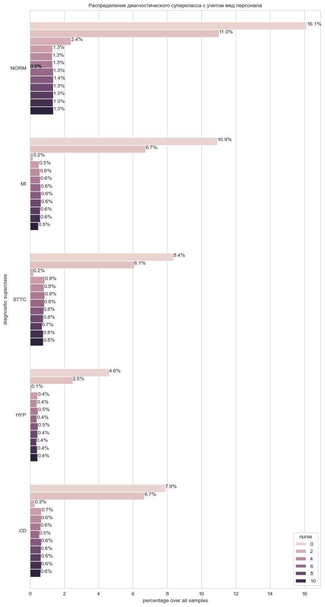
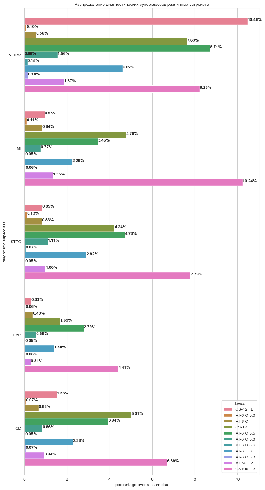
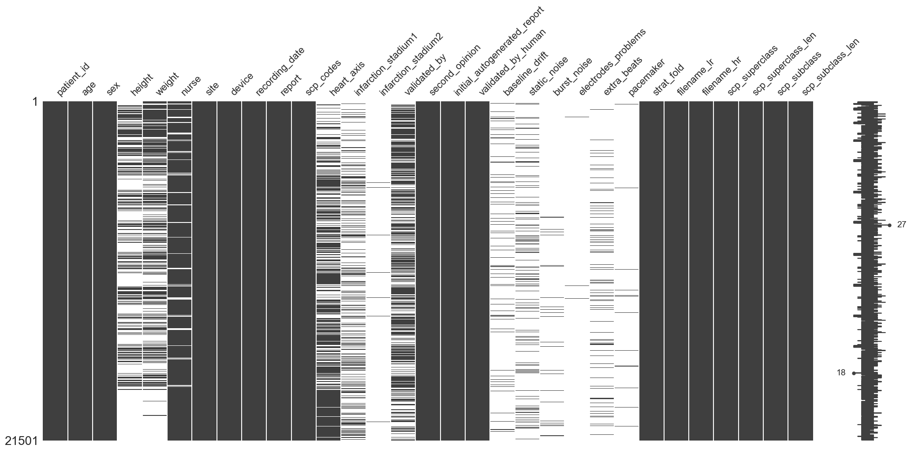

Описание данных:
  ptbxl_database.csv - файл содержащий атрибуты исследуемых объектов (людей). 
  Основные атрибуты: возраст, пол, рост, вес, код диагноза и под классы диагноза

  scp_statements.csv - словарь кодов диагнозов с подклассами.

Значения классов:

NORM: Нормальная ЭКГ

MI: Инфаркт миокарда, инфаркт миокарда (ИМ), широко известный как сердечный приступ, возникает, когда поток крови уменьшается или прекращается в части сердца, вызывая повреждение сердечной мышцы.

STTC: Изменение ST/T. Изменения зубцов ST и T могут указывать на сердечную патологию или быть вариантом нормы. Таким образом, интерпретация результатов зависит от клинического контекста и наличия аналогичных результатов на предыдущих электрокардиограммах.

CD: Conduction Disturbance. Ваш сердечный ритм – это то, как бьется ваше сердце. Проводимость – это то, как электрические импульсы проходят через ваше сердце, заставляя его биться. Некоторые нарушения проводимости могут вызывать аритмии или нерегулярное сердцебиение.

HYP: Гипертрофия. Гипертрофическая кардиомиопатия (ГКМП) — заболевание, при котором сердечная мышца становится аномально толстой (гипертрофированной). Утолщенная сердечная мышца может затруднить перекачку крови сердцу.


```python
!pip install wfdb
```

    Requirement already satisfied: wfdb in /opt/anaconda3/lib/python3.12/site-packages (4.1.2)
    Requirement already satisfied: SoundFile>=0.10.0 in /opt/anaconda3/lib/python3.12/site-packages (from wfdb) (0.12.1)
    Requirement already satisfied: matplotlib>=3.2.2 in /opt/anaconda3/lib/python3.12/site-packages (from wfdb) (3.9.2)
    Requirement already satisfied: numpy>=1.10.1 in /opt/anaconda3/lib/python3.12/site-packages (from wfdb) (1.26.4)
    Requirement already satisfied: pandas>=1.3.0 in /opt/anaconda3/lib/python3.12/site-packages (from wfdb) (2.2.2)
    Requirement already satisfied: requests>=2.8.1 in /opt/anaconda3/lib/python3.12/site-packages (from wfdb) (2.32.3)
    Requirement already satisfied: scipy>=1.0.0 in /opt/anaconda3/lib/python3.12/site-packages (from wfdb) (1.13.1)
    Requirement already satisfied: contourpy>=1.0.1 in /opt/anaconda3/lib/python3.12/site-packages (from matplotlib>=3.2.2->wfdb) (1.2.0)
    Requirement already satisfied: cycler>=0.10 in /opt/anaconda3/lib/python3.12/site-packages (from matplotlib>=3.2.2->wfdb) (0.11.0)
    Requirement already satisfied: fonttools>=4.22.0 in /opt/anaconda3/lib/python3.12/site-packages (from matplotlib>=3.2.2->wfdb) (4.51.0)
    Requirement already satisfied: kiwisolver>=1.3.1 in /opt/anaconda3/lib/python3.12/site-packages (from matplotlib>=3.2.2->wfdb) (1.4.4)
    Requirement already satisfied: packaging>=20.0 in /opt/anaconda3/lib/python3.12/site-packages (from matplotlib>=3.2.2->wfdb) (24.1)
    Requirement already satisfied: pillow>=8 in /opt/anaconda3/lib/python3.12/site-packages (from matplotlib>=3.2.2->wfdb) (10.4.0)
    Requirement already satisfied: pyparsing>=2.3.1 in /opt/anaconda3/lib/python3.12/site-packages (from matplotlib>=3.2.2->wfdb) (3.1.2)
    Requirement already satisfied: python-dateutil>=2.7 in /opt/anaconda3/lib/python3.12/site-packages (from matplotlib>=3.2.2->wfdb) (2.9.0.post0)
    Requirement already satisfied: pytz>=2020.1 in /opt/anaconda3/lib/python3.12/site-packages (from pandas>=1.3.0->wfdb) (2024.1)
    Requirement already satisfied: tzdata>=2022.7 in /opt/anaconda3/lib/python3.12/site-packages (from pandas>=1.3.0->wfdb) (2023.3)
    Requirement already satisfied: charset-normalizer<4,>=2 in /opt/anaconda3/lib/python3.12/site-packages (from requests>=2.8.1->wfdb) (3.3.2)
    Requirement already satisfied: idna<4,>=2.5 in /opt/anaconda3/lib/python3.12/site-packages (from requests>=2.8.1->wfdb) (3.7)
    Requirement already satisfied: urllib3<3,>=1.21.1 in /opt/anaconda3/lib/python3.12/site-packages (from requests>=2.8.1->wfdb) (2.2.3)
    Requirement already satisfied: certifi>=2017.4.17 in /opt/anaconda3/lib/python3.12/site-packages (from requests>=2.8.1->wfdb) (2024.8.30)
    Requirement already satisfied: cffi>=1.0 in /opt/anaconda3/lib/python3.12/site-packages (from SoundFile>=0.10.0->wfdb) (1.17.1)
    Requirement already satisfied: pycparser in /opt/anaconda3/lib/python3.12/site-packages (from cffi>=1.0->SoundFile>=0.10.0->wfdb) (2.21)
    Requirement already satisfied: six>=1.5 in /opt/anaconda3/lib/python3.12/site-packages (from python-dateutil>=2.7->matplotlib>=3.2.2->wfdb) (1.16.0)


```python
import pandas as pd
import numpy as np
import wfdb
import ast
from tqdm import tqdm
import warnings; warnings.filterwarnings('ignore')
from IPython.display import display

import matplotlib.pyplot as plt
import seaborn as sns
%matplotlib inline
```


```python
import wfdb
import ast

def load_raw_data(df, sampling_rate, path):
    if sampling_rate == 100:
        data = [wfdb.rdsamp(path+f) for f in df.filename_lr]
    else:
        data = [wfdb.rdsamp(path+f) for f in df.filename_hr]
    data = np.array([signal for signal, meta in data])
    return data

path = './dataset/'
sampling_rate=500

# Загрузка аннотационных данных
df = pd.read_csv(path+'ptbxl_database.csv', index_col='ecg_id')
df.scp_codes = df.scp_codes.apply(lambda x: ast.literal_eval(x))


```


```python
df.describe(include='all')
```


<div>
<style scoped>
    .dataframe tbody tr th:only-of-type {
        vertical-align: middle;
    }

    .dataframe tbody tr th {
        vertical-align: top;
    }

    .dataframe thead th {
        text-align: right;
    }
</style>
<table border="1" class="dataframe">
  <thead>
    <tr style="text-align: right;">
      <th></th>
      <th>patient_id</th>
      <th>age</th>
      <th>sex</th>
      <th>height</th>
      <th>weight</th>
      <th>nurse</th>
      <th>site</th>
      <th>device</th>
      <th>recording_date</th>
      <th>report</th>
      <th>...</th>
      <th>validated_by_human</th>
      <th>baseline_drift</th>
      <th>static_noise</th>
      <th>burst_noise</th>
      <th>electrodes_problems</th>
      <th>extra_beats</th>
      <th>pacemaker</th>
      <th>strat_fold</th>
      <th>filename_lr</th>
      <th>filename_hr</th>
    </tr>
  </thead>
  <tbody>
    <tr>
      <th>count</th>
      <td>21799.000000</td>
      <td>21799.000000</td>
      <td>21799.000000</td>
      <td>6974.000000</td>
      <td>9421.000000</td>
      <td>20326.000000</td>
      <td>21782.000000</td>
      <td>21799</td>
      <td>21799</td>
      <td>21799</td>
      <td>...</td>
      <td>21799</td>
      <td>1598</td>
      <td>3260</td>
      <td>613</td>
      <td>30</td>
      <td>1949</td>
      <td>291</td>
      <td>21799.000000</td>
      <td>21799</td>
      <td>21799</td>
    </tr>
    <tr>
      <th>unique</th>
      <td>NaN</td>
      <td>NaN</td>
      <td>NaN</td>
      <td>NaN</td>
      <td>NaN</td>
      <td>NaN</td>
      <td>NaN</td>
      <td>11</td>
      <td>21795</td>
      <td>9887</td>
      <td>...</td>
      <td>2</td>
      <td>317</td>
      <td>124</td>
      <td>103</td>
      <td>14</td>
      <td>128</td>
      <td>4</td>
      <td>NaN</td>
      <td>21799</td>
      <td>21799</td>
    </tr>
    <tr>
      <th>top</th>
      <td>NaN</td>
      <td>NaN</td>
      <td>NaN</td>
      <td>NaN</td>
      <td>NaN</td>
      <td>NaN</td>
      <td>NaN</td>
      <td>CS100    3</td>
      <td>1992-02-06 11:47:42</td>
      <td>sinus rhythm. normal ecg.</td>
      <td>...</td>
      <td>True</td>
      <td>, V6</td>
      <td>, I-AVR,</td>
      <td>alles</td>
      <td>V6</td>
      <td>1ES</td>
      <td>ja, pacemaker</td>
      <td>NaN</td>
      <td>records100/00000/00001_lr</td>
      <td>records500/00000/00001_hr</td>
    </tr>
    <tr>
      <th>freq</th>
      <td>NaN</td>
      <td>NaN</td>
      <td>NaN</td>
      <td>NaN</td>
      <td>NaN</td>
      <td>NaN</td>
      <td>NaN</td>
      <td>6140</td>
      <td>2</td>
      <td>1734</td>
      <td>...</td>
      <td>16056</td>
      <td>221</td>
      <td>953</td>
      <td>140</td>
      <td>8</td>
      <td>405</td>
      <td>285</td>
      <td>NaN</td>
      <td>1</td>
      <td>1</td>
    </tr>
    <tr>
      <th>mean</th>
      <td>11250.156521</td>
      <td>62.769301</td>
      <td>0.479150</td>
      <td>166.702323</td>
      <td>70.995223</td>
      <td>2.291745</td>
      <td>1.544945</td>
      <td>NaN</td>
      <td>NaN</td>
      <td>NaN</td>
      <td>...</td>
      <td>NaN</td>
      <td>NaN</td>
      <td>NaN</td>
      <td>NaN</td>
      <td>NaN</td>
      <td>NaN</td>
      <td>NaN</td>
      <td>5.503005</td>
      <td>NaN</td>
      <td>NaN</td>
    </tr>
    <tr>
      <th>std</th>
      <td>6235.026404</td>
      <td>32.308813</td>
      <td>0.499577</td>
      <td>10.867321</td>
      <td>15.878803</td>
      <td>3.254033</td>
      <td>4.172883</td>
      <td>NaN</td>
      <td>NaN</td>
      <td>NaN</td>
      <td>...</td>
      <td>NaN</td>
      <td>NaN</td>
      <td>NaN</td>
      <td>NaN</td>
      <td>NaN</td>
      <td>NaN</td>
      <td>NaN</td>
      <td>2.874948</td>
      <td>NaN</td>
      <td>NaN</td>
    </tr>
    <tr>
      <th>min</th>
      <td>302.000000</td>
      <td>2.000000</td>
      <td>0.000000</td>
      <td>6.000000</td>
      <td>5.000000</td>
      <td>0.000000</td>
      <td>0.000000</td>
      <td>NaN</td>
      <td>NaN</td>
      <td>NaN</td>
      <td>...</td>
      <td>NaN</td>
      <td>NaN</td>
      <td>NaN</td>
      <td>NaN</td>
      <td>NaN</td>
      <td>NaN</td>
      <td>NaN</td>
      <td>1.000000</td>
      <td>NaN</td>
      <td>NaN</td>
    </tr>
    <tr>
      <th>25%</th>
      <td>5974.500000</td>
      <td>50.000000</td>
      <td>0.000000</td>
      <td>160.000000</td>
      <td>60.000000</td>
      <td>0.000000</td>
      <td>0.000000</td>
      <td>NaN</td>
      <td>NaN</td>
      <td>NaN</td>
      <td>...</td>
      <td>NaN</td>
      <td>NaN</td>
      <td>NaN</td>
      <td>NaN</td>
      <td>NaN</td>
      <td>NaN</td>
      <td>NaN</td>
      <td>3.000000</td>
      <td>NaN</td>
      <td>NaN</td>
    </tr>
    <tr>
      <th>50%</th>
      <td>11419.000000</td>
      <td>62.000000</td>
      <td>0.000000</td>
      <td>166.000000</td>
      <td>70.000000</td>
      <td>1.000000</td>
      <td>1.000000</td>
      <td>NaN</td>
      <td>NaN</td>
      <td>NaN</td>
      <td>...</td>
      <td>NaN</td>
      <td>NaN</td>
      <td>NaN</td>
      <td>NaN</td>
      <td>NaN</td>
      <td>NaN</td>
      <td>NaN</td>
      <td>6.000000</td>
      <td>NaN</td>
      <td>NaN</td>
    </tr>
    <tr>
      <th>75%</th>
      <td>16607.500000</td>
      <td>72.000000</td>
      <td>1.000000</td>
      <td>174.000000</td>
      <td>80.000000</td>
      <td>3.000000</td>
      <td>2.000000</td>
      <td>NaN</td>
      <td>NaN</td>
      <td>NaN</td>
      <td>...</td>
      <td>NaN</td>
      <td>NaN</td>
      <td>NaN</td>
      <td>NaN</td>
      <td>NaN</td>
      <td>NaN</td>
      <td>NaN</td>
      <td>8.000000</td>
      <td>NaN</td>
      <td>NaN</td>
    </tr>
    <tr>
      <th>max</th>
      <td>21797.000000</td>
      <td>300.000000</td>
      <td>1.000000</td>
      <td>209.000000</td>
      <td>250.000000</td>
      <td>11.000000</td>
      <td>50.000000</td>
      <td>NaN</td>
      <td>NaN</td>
      <td>NaN</td>
      <td>...</td>
      <td>NaN</td>
      <td>NaN</td>
      <td>NaN</td>
      <td>NaN</td>
      <td>NaN</td>
      <td>NaN</td>
      <td>NaN</td>
      <td>10.000000</td>
      <td>NaN</td>
      <td>NaN</td>
    </tr>
  </tbody>
</table>
<p>11 rows × 27 columns</p>
</div>


```python
def remove_outliers(data, col):
    column = data[col]
    IQR = column.quantile(0.75) - column.quantile(0.25)
    h = column.quantile(0.75) + 1.5 * IQR
    l = column.quantile(0.25) - 1.5 * IQR
    return data[column.between(l, h)]
```


```python
df = remove_outliers(df, "age")
```


```python
df.describe(include='all')
```


<div>
<style scoped>
    .dataframe tbody tr th:only-of-type {
        vertical-align: middle;
    }

    .dataframe tbody tr th {
        vertical-align: top;
    }

    .dataframe thead th {
        text-align: right;
    }
</style>
<table border="1" class="dataframe">
  <thead>
    <tr style="text-align: right;">
      <th></th>
      <th>patient_id</th>
      <th>age</th>
      <th>sex</th>
      <th>height</th>
      <th>weight</th>
      <th>nurse</th>
      <th>site</th>
      <th>device</th>
      <th>recording_date</th>
      <th>report</th>
      <th>...</th>
      <th>validated_by_human</th>
      <th>baseline_drift</th>
      <th>static_noise</th>
      <th>burst_noise</th>
      <th>electrodes_problems</th>
      <th>extra_beats</th>
      <th>pacemaker</th>
      <th>strat_fold</th>
      <th>filename_lr</th>
      <th>filename_hr</th>
    </tr>
  </thead>
  <tbody>
    <tr>
      <th>count</th>
      <td>21414.000000</td>
      <td>21414.000000</td>
      <td>21414.000000</td>
      <td>6779.000000</td>
      <td>9207.000000</td>
      <td>19977.000000</td>
      <td>21399.000000</td>
      <td>21414</td>
      <td>21414</td>
      <td>21414</td>
      <td>...</td>
      <td>21414</td>
      <td>1564</td>
      <td>3211</td>
      <td>600</td>
      <td>29</td>
      <td>1898</td>
      <td>283</td>
      <td>21414.000000</td>
      <td>21414</td>
      <td>21414</td>
    </tr>
    <tr>
      <th>unique</th>
      <td>NaN</td>
      <td>NaN</td>
      <td>NaN</td>
      <td>NaN</td>
      <td>NaN</td>
      <td>NaN</td>
      <td>NaN</td>
      <td>11</td>
      <td>21410</td>
      <td>9641</td>
      <td>...</td>
      <td>2</td>
      <td>311</td>
      <td>121</td>
      <td>101</td>
      <td>14</td>
      <td>128</td>
      <td>4</td>
      <td>NaN</td>
      <td>21414</td>
      <td>21414</td>
    </tr>
    <tr>
      <th>top</th>
      <td>NaN</td>
      <td>NaN</td>
      <td>NaN</td>
      <td>NaN</td>
      <td>NaN</td>
      <td>NaN</td>
      <td>NaN</td>
      <td>CS100    3</td>
      <td>1992-02-06 11:47:42</td>
      <td>sinus rhythm. normal ecg.</td>
      <td>...</td>
      <td>True</td>
      <td>, V6</td>
      <td>, I-AVR,</td>
      <td>alles</td>
      <td>V6</td>
      <td>1ES</td>
      <td>ja, pacemaker</td>
      <td>NaN</td>
      <td>records100/00000/00001_lr</td>
      <td>records500/00000/00001_hr</td>
    </tr>
    <tr>
      <th>freq</th>
      <td>NaN</td>
      <td>NaN</td>
      <td>NaN</td>
      <td>NaN</td>
      <td>NaN</td>
      <td>NaN</td>
      <td>NaN</td>
      <td>6107</td>
      <td>2</td>
      <td>1720</td>
      <td>...</td>
      <td>15698</td>
      <td>215</td>
      <td>939</td>
      <td>140</td>
      <td>8</td>
      <td>390</td>
      <td>278</td>
      <td>NaN</td>
      <td>1</td>
      <td>1</td>
    </tr>
    <tr>
      <th>mean</th>
      <td>11291.244186</td>
      <td>59.736201</td>
      <td>0.475016</td>
      <td>166.930226</td>
      <td>71.366895</td>
      <td>2.271412</td>
      <td>1.531707</td>
      <td>NaN</td>
      <td>NaN</td>
      <td>NaN</td>
      <td>...</td>
      <td>NaN</td>
      <td>NaN</td>
      <td>NaN</td>
      <td>NaN</td>
      <td>NaN</td>
      <td>NaN</td>
      <td>NaN</td>
      <td>5.499626</td>
      <td>NaN</td>
      <td>NaN</td>
    </tr>
    <tr>
      <th>std</th>
      <td>6224.296487</td>
      <td>16.515259</td>
      <td>0.499387</td>
      <td>10.647564</td>
      <td>15.707767</td>
      <td>3.247071</td>
      <td>4.157050</td>
      <td>NaN</td>
      <td>NaN</td>
      <td>NaN</td>
      <td>...</td>
      <td>NaN</td>
      <td>NaN</td>
      <td>NaN</td>
      <td>NaN</td>
      <td>NaN</td>
      <td>NaN</td>
      <td>NaN</td>
      <td>2.875744</td>
      <td>NaN</td>
      <td>NaN</td>
    </tr>
    <tr>
      <th>min</th>
      <td>302.000000</td>
      <td>17.000000</td>
      <td>0.000000</td>
      <td>6.000000</td>
      <td>5.000000</td>
      <td>0.000000</td>
      <td>0.000000</td>
      <td>NaN</td>
      <td>NaN</td>
      <td>NaN</td>
      <td>...</td>
      <td>NaN</td>
      <td>NaN</td>
      <td>NaN</td>
      <td>NaN</td>
      <td>NaN</td>
      <td>NaN</td>
      <td>NaN</td>
      <td>1.000000</td>
      <td>NaN</td>
      <td>NaN</td>
    </tr>
    <tr>
      <th>25%</th>
      <td>6056.250000</td>
      <td>50.000000</td>
      <td>0.000000</td>
      <td>160.000000</td>
      <td>60.000000</td>
      <td>0.000000</td>
      <td>0.000000</td>
      <td>NaN</td>
      <td>NaN</td>
      <td>NaN</td>
      <td>...</td>
      <td>NaN</td>
      <td>NaN</td>
      <td>NaN</td>
      <td>NaN</td>
      <td>NaN</td>
      <td>NaN</td>
      <td>NaN</td>
      <td>3.000000</td>
      <td>NaN</td>
      <td>NaN</td>
    </tr>
    <tr>
      <th>50%</th>
      <td>11466.500000</td>
      <td>62.000000</td>
      <td>0.000000</td>
      <td>166.000000</td>
      <td>70.000000</td>
      <td>1.000000</td>
      <td>1.000000</td>
      <td>NaN</td>
      <td>NaN</td>
      <td>NaN</td>
      <td>...</td>
      <td>NaN</td>
      <td>NaN</td>
      <td>NaN</td>
      <td>NaN</td>
      <td>NaN</td>
      <td>NaN</td>
      <td>NaN</td>
      <td>5.000000</td>
      <td>NaN</td>
      <td>NaN</td>
    </tr>
    <tr>
      <th>75%</th>
      <td>16637.000000</td>
      <td>72.000000</td>
      <td>1.000000</td>
      <td>174.000000</td>
      <td>80.000000</td>
      <td>3.000000</td>
      <td>2.000000</td>
      <td>NaN</td>
      <td>NaN</td>
      <td>NaN</td>
      <td>...</td>
      <td>NaN</td>
      <td>NaN</td>
      <td>NaN</td>
      <td>NaN</td>
      <td>NaN</td>
      <td>NaN</td>
      <td>NaN</td>
      <td>8.000000</td>
      <td>NaN</td>
      <td>NaN</td>
    </tr>
    <tr>
      <th>max</th>
      <td>21797.000000</td>
      <td>89.000000</td>
      <td>1.000000</td>
      <td>209.000000</td>
      <td>250.000000</td>
      <td>11.000000</td>
      <td>50.000000</td>
      <td>NaN</td>
      <td>NaN</td>
      <td>NaN</td>
      <td>...</td>
      <td>NaN</td>
      <td>NaN</td>
      <td>NaN</td>
      <td>NaN</td>
      <td>NaN</td>
      <td>NaN</td>
      <td>NaN</td>
      <td>10.000000</td>
      <td>NaN</td>
      <td>NaN</td>
    </tr>
  </tbody>
</table>
<p>11 rows × 27 columns</p>
</div>


```python
df.shape
```


    (21414, 27)


```python
# Загрузка сигнальных данных
x_raw_data = load_raw_data(df, sampling_rate, path)
scp_df = pd.read_csv(path+'scp_statements.csv', index_col=0)
scp_df = scp_df[scp_df.diagnostic == 1]

def make_super_class(y_dic):
    tmp = []
    for key in y_dic.keys():
        if key in scp_df.index:
            tmp.append(scp_df.loc[key].diagnostic_class)
    return list(set(tmp))

# Создание колонки списка классов диагнозов
df['scp_superclass'] = df.scp_codes.apply(make_super_class)
```


```python
df.head(5)
```


<div>
<style scoped>
    .dataframe tbody tr th:only-of-type {
        vertical-align: middle;
    }

    .dataframe tbody tr th {
        vertical-align: top;
    }

    .dataframe thead th {
        text-align: right;
    }
</style>
<table border="1" class="dataframe">
  <thead>
    <tr style="text-align: right;">
      <th></th>
      <th>patient_id</th>
      <th>age</th>
      <th>sex</th>
      <th>height</th>
      <th>weight</th>
      <th>nurse</th>
      <th>site</th>
      <th>device</th>
      <th>recording_date</th>
      <th>report</th>
      <th>...</th>
      <th>baseline_drift</th>
      <th>static_noise</th>
      <th>burst_noise</th>
      <th>electrodes_problems</th>
      <th>extra_beats</th>
      <th>pacemaker</th>
      <th>strat_fold</th>
      <th>filename_lr</th>
      <th>filename_hr</th>
      <th>scp_superclass</th>
    </tr>
    <tr>
      <th>ecg_id</th>
      <th></th>
      <th></th>
      <th></th>
      <th></th>
      <th></th>
      <th></th>
      <th></th>
      <th></th>
      <th></th>
      <th></th>
      <th></th>
      <th></th>
      <th></th>
      <th></th>
      <th></th>
      <th></th>
      <th></th>
      <th></th>
      <th></th>
      <th></th>
      <th></th>
    </tr>
  </thead>
  <tbody>
    <tr>
      <th>1</th>
      <td>15709.0</td>
      <td>56.0</td>
      <td>1</td>
      <td>NaN</td>
      <td>63.0</td>
      <td>2.0</td>
      <td>0.0</td>
      <td>CS-12   E</td>
      <td>1984-11-09 09:17:34</td>
      <td>sinusrhythmus periphere niederspannung</td>
      <td>...</td>
      <td>NaN</td>
      <td>, I-V1,</td>
      <td>NaN</td>
      <td>NaN</td>
      <td>NaN</td>
      <td>NaN</td>
      <td>3</td>
      <td>records100/00000/00001_lr</td>
      <td>records500/00000/00001_hr</td>
      <td>[NORM]</td>
    </tr>
    <tr>
      <th>2</th>
      <td>13243.0</td>
      <td>19.0</td>
      <td>0</td>
      <td>NaN</td>
      <td>70.0</td>
      <td>2.0</td>
      <td>0.0</td>
      <td>CS-12   E</td>
      <td>1984-11-14 12:55:37</td>
      <td>sinusbradykardie sonst normales ekg</td>
      <td>...</td>
      <td>NaN</td>
      <td>NaN</td>
      <td>NaN</td>
      <td>NaN</td>
      <td>NaN</td>
      <td>NaN</td>
      <td>2</td>
      <td>records100/00000/00002_lr</td>
      <td>records500/00000/00002_hr</td>
      <td>[NORM]</td>
    </tr>
    <tr>
      <th>3</th>
      <td>20372.0</td>
      <td>37.0</td>
      <td>1</td>
      <td>NaN</td>
      <td>69.0</td>
      <td>2.0</td>
      <td>0.0</td>
      <td>CS-12   E</td>
      <td>1984-11-15 12:49:10</td>
      <td>sinusrhythmus normales ekg</td>
      <td>...</td>
      <td>NaN</td>
      <td>NaN</td>
      <td>NaN</td>
      <td>NaN</td>
      <td>NaN</td>
      <td>NaN</td>
      <td>5</td>
      <td>records100/00000/00003_lr</td>
      <td>records500/00000/00003_hr</td>
      <td>[NORM]</td>
    </tr>
    <tr>
      <th>4</th>
      <td>17014.0</td>
      <td>24.0</td>
      <td>0</td>
      <td>NaN</td>
      <td>82.0</td>
      <td>2.0</td>
      <td>0.0</td>
      <td>CS-12   E</td>
      <td>1984-11-15 13:44:57</td>
      <td>sinusrhythmus normales ekg</td>
      <td>...</td>
      <td>, II,III,AVF</td>
      <td>NaN</td>
      <td>NaN</td>
      <td>NaN</td>
      <td>NaN</td>
      <td>NaN</td>
      <td>3</td>
      <td>records100/00000/00004_lr</td>
      <td>records500/00000/00004_hr</td>
      <td>[NORM]</td>
    </tr>
    <tr>
      <th>5</th>
      <td>17448.0</td>
      <td>19.0</td>
      <td>1</td>
      <td>NaN</td>
      <td>70.0</td>
      <td>2.0</td>
      <td>0.0</td>
      <td>CS-12   E</td>
      <td>1984-11-17 10:43:15</td>
      <td>sinusrhythmus normales ekg</td>
      <td>...</td>
      <td>, III,AVR,AVF</td>
      <td>NaN</td>
      <td>NaN</td>
      <td>NaN</td>
      <td>NaN</td>
      <td>NaN</td>
      <td>4</td>
      <td>records100/00000/00005_lr</td>
      <td>records500/00000/00005_hr</td>
      <td>[NORM]</td>
    </tr>
  </tbody>
</table>
<p>5 rows × 28 columns</p>
</div>


Отобразим матрицу сигналов с ЭКГ


```python
x_raw_data
```


    array([[[-0.115, -0.05 ,  0.065, ..., -0.035, -0.035, -0.075],
            [-0.115, -0.05 ,  0.065, ..., -0.035, -0.035, -0.075],
            [-0.115, -0.05 ,  0.065, ..., -0.035, -0.035, -0.075],
            ...,
            [ 0.21 ,  0.205, -0.005, ...,  0.185,  0.17 ,  0.18 ],
            [ 0.21 ,  0.205, -0.005, ...,  0.185,  0.17 ,  0.18 ],
            [ 0.21 ,  0.205, -0.005, ...,  0.185,  0.17 ,  0.18 ]],
    
           [[-0.015,  0.12 ,  0.135, ...,  0.16 ,  0.06 ,  0.065],
            [-0.015,  0.12 ,  0.135, ...,  0.16 ,  0.06 ,  0.065],
            [-0.015,  0.12 ,  0.135, ...,  0.16 ,  0.06 ,  0.065],
            ...,
            [-0.055,  0.015,  0.07 , ..., -0.215, -0.195, -0.13 ],
            [-0.055,  0.015,  0.07 , ..., -0.215, -0.195, -0.13 ],
            [-0.055,  0.015,  0.07 , ..., -0.215, -0.195, -0.13 ]],
    
           [[-0.035, -0.07 , -0.035, ..., -0.1  , -0.075, -0.065],
            [-0.035, -0.07 , -0.035, ..., -0.1  , -0.075, -0.065],
            [-0.035, -0.07 , -0.035, ..., -0.1  , -0.075, -0.065],
            ...,
            [-0.04 , -0.18 , -0.14 , ..., -0.015,  0.02 ,  0.025],
            [-0.04 , -0.18 , -0.14 , ..., -0.015,  0.02 ,  0.025],
            [-0.04 , -0.18 , -0.14 , ..., -0.015,  0.02 ,  0.025]],
    
           ...,
    
           [[ 0.09 ,  0.08 , -0.01 , ...,  0.015,  0.03 ,  0.04 ],
            [ 0.09 ,  0.08 , -0.01 , ...,  0.015,  0.03 ,  0.04 ],
            [ 0.09 ,  0.08 , -0.01 , ...,  0.015,  0.03 ,  0.04 ],
            ...,
            [-0.055, -0.055,  0.   , ..., -0.025, -0.05 , -0.055],
            [-0.055, -0.055,  0.   , ..., -0.025, -0.05 , -0.055],
            [-0.055, -0.055,  0.   , ..., -0.025, -0.05 , -0.055]],
    
           [[-0.045, -0.035,  0.01 , ..., -0.025, -0.03 , -0.03 ],
            [-0.045, -0.035,  0.01 , ..., -0.025, -0.03 , -0.03 ],
            [-0.045, -0.035,  0.01 , ..., -0.025, -0.03 , -0.03 ],
            ...,
            [ 0.07 ,  0.21 ,  0.14 , ...,  0.21 ,  0.185,  0.13 ],
            [ 0.07 ,  0.21 ,  0.14 , ...,  0.21 ,  0.185,  0.13 ],
            [ 0.07 ,  0.21 ,  0.14 , ...,  0.21 ,  0.185,  0.13 ]],
    
           [[-0.05 , -0.03 ,  0.02 , ..., -0.035, -0.03 , -0.035],
            [-0.05 , -0.03 ,  0.02 , ..., -0.035, -0.03 , -0.035],
            [-0.05 , -0.03 ,  0.02 , ..., -0.035, -0.03 , -0.035],
            ...,
            [-0.07 , -0.07 ,  0.   , ..., -0.06 , -0.07 , -0.07 ],
            [-0.07 , -0.07 ,  0.   , ..., -0.06 , -0.07 , -0.07 ],
            [-0.07 , -0.07 ,  0.   , ..., -0.06 , -0.07 , -0.07 ]]])


```python
df.info()
```

    <class 'pandas.core.frame.DataFrame'>
    Index: 21414 entries, 1 to 21837
    Data columns (total 28 columns):
     #   Column                        Non-Null Count  Dtype  
    ---  ------                        --------------  -----  
     0   patient_id                    21414 non-null  float64
     1   age                           21414 non-null  float64
     2   sex                           21414 non-null  int64  
     3   height                        6779 non-null   float64
     4   weight                        9207 non-null   float64
     5   nurse                         19977 non-null  float64
     6   site                          21399 non-null  float64
     7   device                        21414 non-null  object 
     8   recording_date                21414 non-null  object 
     9   report                        21414 non-null  object 
     10  scp_codes                     21414 non-null  object 
     11  heart_axis                    13118 non-null  object 
     12  infarction_stadium1           5488 non-null   object 
     13  infarction_stadium2           100 non-null    object 
     14  validated_by                  12104 non-null  float64
     15  second_opinion                21414 non-null  bool   
     16  initial_autogenerated_report  21414 non-null  bool   
     17  validated_by_human            21414 non-null  bool   
     18  baseline_drift                1564 non-null   object 
     19  static_noise                  3211 non-null   object 
     20  burst_noise                   600 non-null    object 
     21  electrodes_problems           29 non-null     object 
     22  extra_beats                   1898 non-null   object 
     23  pacemaker                     283 non-null    object 
     24  strat_fold                    21414 non-null  int64  
     25  filename_lr                   21414 non-null  object 
     26  filename_hr                   21414 non-null  object 
     27  scp_superclass                21414 non-null  object 
    dtypes: bool(3), float64(7), int64(2), object(16)
    memory usage: 4.3+ MB


```python
df.patient_id = df.patient_id.astype(int)
df.validated_by = df.validated_by.astype('Int64')
df.nurse = df.nurse.astype('Int64')
df.site = df.site.astype('Int64')
```


```python
df.describe(include='all')
```


<div>
<style scoped>
    .dataframe tbody tr th:only-of-type {
        vertical-align: middle;
    }

    .dataframe tbody tr th {
        vertical-align: top;
    }

    .dataframe thead th {
        text-align: right;
    }
</style>
<table border="1" class="dataframe">
  <thead>
    <tr style="text-align: right;">
      <th></th>
      <th>patient_id</th>
      <th>age</th>
      <th>sex</th>
      <th>height</th>
      <th>weight</th>
      <th>nurse</th>
      <th>site</th>
      <th>device</th>
      <th>recording_date</th>
      <th>report</th>
      <th>...</th>
      <th>baseline_drift</th>
      <th>static_noise</th>
      <th>burst_noise</th>
      <th>electrodes_problems</th>
      <th>extra_beats</th>
      <th>pacemaker</th>
      <th>strat_fold</th>
      <th>filename_lr</th>
      <th>filename_hr</th>
      <th>scp_superclass</th>
    </tr>
  </thead>
  <tbody>
    <tr>
      <th>count</th>
      <td>21414.000000</td>
      <td>21414.000000</td>
      <td>21414.000000</td>
      <td>6779.000000</td>
      <td>9207.000000</td>
      <td>19977.0</td>
      <td>21399.0</td>
      <td>21414</td>
      <td>21414</td>
      <td>21414</td>
      <td>...</td>
      <td>1564</td>
      <td>3211</td>
      <td>600</td>
      <td>29</td>
      <td>1898</td>
      <td>283</td>
      <td>21414.000000</td>
      <td>21414</td>
      <td>21414</td>
      <td>21414</td>
    </tr>
    <tr>
      <th>unique</th>
      <td>NaN</td>
      <td>NaN</td>
      <td>NaN</td>
      <td>NaN</td>
      <td>NaN</td>
      <td>&lt;NA&gt;</td>
      <td>&lt;NA&gt;</td>
      <td>11</td>
      <td>21410</td>
      <td>9641</td>
      <td>...</td>
      <td>311</td>
      <td>121</td>
      <td>101</td>
      <td>14</td>
      <td>128</td>
      <td>4</td>
      <td>NaN</td>
      <td>21414</td>
      <td>21414</td>
      <td>27</td>
    </tr>
    <tr>
      <th>top</th>
      <td>NaN</td>
      <td>NaN</td>
      <td>NaN</td>
      <td>NaN</td>
      <td>NaN</td>
      <td>&lt;NA&gt;</td>
      <td>&lt;NA&gt;</td>
      <td>CS100    3</td>
      <td>1992-02-06 11:47:42</td>
      <td>sinus rhythm. normal ecg.</td>
      <td>...</td>
      <td>, V6</td>
      <td>, I-AVR,</td>
      <td>alles</td>
      <td>V6</td>
      <td>1ES</td>
      <td>ja, pacemaker</td>
      <td>NaN</td>
      <td>records100/00000/00001_lr</td>
      <td>records500/00000/00001_hr</td>
      <td>[NORM]</td>
    </tr>
    <tr>
      <th>freq</th>
      <td>NaN</td>
      <td>NaN</td>
      <td>NaN</td>
      <td>NaN</td>
      <td>NaN</td>
      <td>&lt;NA&gt;</td>
      <td>&lt;NA&gt;</td>
      <td>6107</td>
      <td>2</td>
      <td>1720</td>
      <td>...</td>
      <td>215</td>
      <td>939</td>
      <td>140</td>
      <td>8</td>
      <td>390</td>
      <td>278</td>
      <td>NaN</td>
      <td>1</td>
      <td>1</td>
      <td>8967</td>
    </tr>
    <tr>
      <th>mean</th>
      <td>11291.244186</td>
      <td>59.736201</td>
      <td>0.475016</td>
      <td>166.930226</td>
      <td>71.366895</td>
      <td>2.271412</td>
      <td>1.531707</td>
      <td>NaN</td>
      <td>NaN</td>
      <td>NaN</td>
      <td>...</td>
      <td>NaN</td>
      <td>NaN</td>
      <td>NaN</td>
      <td>NaN</td>
      <td>NaN</td>
      <td>NaN</td>
      <td>5.499626</td>
      <td>NaN</td>
      <td>NaN</td>
      <td>NaN</td>
    </tr>
    <tr>
      <th>std</th>
      <td>6224.296487</td>
      <td>16.515259</td>
      <td>0.499387</td>
      <td>10.647564</td>
      <td>15.707767</td>
      <td>3.247071</td>
      <td>4.15705</td>
      <td>NaN</td>
      <td>NaN</td>
      <td>NaN</td>
      <td>...</td>
      <td>NaN</td>
      <td>NaN</td>
      <td>NaN</td>
      <td>NaN</td>
      <td>NaN</td>
      <td>NaN</td>
      <td>2.875744</td>
      <td>NaN</td>
      <td>NaN</td>
      <td>NaN</td>
    </tr>
    <tr>
      <th>min</th>
      <td>302.000000</td>
      <td>17.000000</td>
      <td>0.000000</td>
      <td>6.000000</td>
      <td>5.000000</td>
      <td>0.0</td>
      <td>0.0</td>
      <td>NaN</td>
      <td>NaN</td>
      <td>NaN</td>
      <td>...</td>
      <td>NaN</td>
      <td>NaN</td>
      <td>NaN</td>
      <td>NaN</td>
      <td>NaN</td>
      <td>NaN</td>
      <td>1.000000</td>
      <td>NaN</td>
      <td>NaN</td>
      <td>NaN</td>
    </tr>
    <tr>
      <th>25%</th>
      <td>6056.250000</td>
      <td>50.000000</td>
      <td>0.000000</td>
      <td>160.000000</td>
      <td>60.000000</td>
      <td>0.0</td>
      <td>0.0</td>
      <td>NaN</td>
      <td>NaN</td>
      <td>NaN</td>
      <td>...</td>
      <td>NaN</td>
      <td>NaN</td>
      <td>NaN</td>
      <td>NaN</td>
      <td>NaN</td>
      <td>NaN</td>
      <td>3.000000</td>
      <td>NaN</td>
      <td>NaN</td>
      <td>NaN</td>
    </tr>
    <tr>
      <th>50%</th>
      <td>11466.500000</td>
      <td>62.000000</td>
      <td>0.000000</td>
      <td>166.000000</td>
      <td>70.000000</td>
      <td>1.0</td>
      <td>1.0</td>
      <td>NaN</td>
      <td>NaN</td>
      <td>NaN</td>
      <td>...</td>
      <td>NaN</td>
      <td>NaN</td>
      <td>NaN</td>
      <td>NaN</td>
      <td>NaN</td>
      <td>NaN</td>
      <td>5.000000</td>
      <td>NaN</td>
      <td>NaN</td>
      <td>NaN</td>
    </tr>
    <tr>
      <th>75%</th>
      <td>16637.000000</td>
      <td>72.000000</td>
      <td>1.000000</td>
      <td>174.000000</td>
      <td>80.000000</td>
      <td>3.0</td>
      <td>2.0</td>
      <td>NaN</td>
      <td>NaN</td>
      <td>NaN</td>
      <td>...</td>
      <td>NaN</td>
      <td>NaN</td>
      <td>NaN</td>
      <td>NaN</td>
      <td>NaN</td>
      <td>NaN</td>
      <td>8.000000</td>
      <td>NaN</td>
      <td>NaN</td>
      <td>NaN</td>
    </tr>
    <tr>
      <th>max</th>
      <td>21797.000000</td>
      <td>89.000000</td>
      <td>1.000000</td>
      <td>209.000000</td>
      <td>250.000000</td>
      <td>11.0</td>
      <td>50.0</td>
      <td>NaN</td>
      <td>NaN</td>
      <td>NaN</td>
      <td>...</td>
      <td>NaN</td>
      <td>NaN</td>
      <td>NaN</td>
      <td>NaN</td>
      <td>NaN</td>
      <td>NaN</td>
      <td>10.000000</td>
      <td>NaN</td>
      <td>NaN</td>
      <td>NaN</td>
    </tr>
  </tbody>
</table>
<p>11 rows × 28 columns</p>
</div>


```python
scp_df.info()
```

    <class 'pandas.core.frame.DataFrame'>
    Index: 44 entries, NDT to 2AVB
    Data columns (total 12 columns):
     #   Column                         Non-Null Count  Dtype  
    ---  ------                         --------------  -----  
     0   description                    44 non-null     object 
     1   diagnostic                     44 non-null     float64
     2   form                           4 non-null      float64
     3   rhythm                         0 non-null      float64
     4   diagnostic_class               44 non-null     object 
     5   diagnostic_subclass            44 non-null     object 
     6   Statement Category             44 non-null     object 
     7   SCP-ECG Statement Description  44 non-null     object 
     8   AHA code                       22 non-null     float64
     9   aECG REFID                     12 non-null     object 
     10  CDISC Code                     13 non-null     object 
     11  DICOM Code                     9 non-null      object 
    dtypes: float64(4), object(8)
    memory usage: 5.5+ KB


```python
# Загружаем scp_statements.csv который содержит аббревиатуры и расшифровки диагнозов
print(scp_df.shape)
scp_df.head()
```

    (44, 12)


<div>
<style scoped>
    .dataframe tbody tr th:only-of-type {
        vertical-align: middle;
    }

    .dataframe tbody tr th {
        vertical-align: top;
    }

    .dataframe thead th {
        text-align: right;
    }
</style>
<table border="1" class="dataframe">
  <thead>
    <tr style="text-align: right;">
      <th></th>
      <th>description</th>
      <th>diagnostic</th>
      <th>form</th>
      <th>rhythm</th>
      <th>diagnostic_class</th>
      <th>diagnostic_subclass</th>
      <th>Statement Category</th>
      <th>SCP-ECG Statement Description</th>
      <th>AHA code</th>
      <th>aECG REFID</th>
      <th>CDISC Code</th>
      <th>DICOM Code</th>
    </tr>
  </thead>
  <tbody>
    <tr>
      <th>NDT</th>
      <td>non-diagnostic T abnormalities</td>
      <td>1.0</td>
      <td>1.0</td>
      <td>NaN</td>
      <td>STTC</td>
      <td>STTC</td>
      <td>other ST-T descriptive statements</td>
      <td>non-diagnostic T abnormalities</td>
      <td>NaN</td>
      <td>NaN</td>
      <td>NaN</td>
      <td>NaN</td>
    </tr>
    <tr>
      <th>NST_</th>
      <td>non-specific ST changes</td>
      <td>1.0</td>
      <td>1.0</td>
      <td>NaN</td>
      <td>STTC</td>
      <td>NST_</td>
      <td>Basic roots for coding ST-T changes and abnorm...</td>
      <td>non-specific ST changes</td>
      <td>145.0</td>
      <td>MDC_ECG_RHY_STHILOST</td>
      <td>NaN</td>
      <td>NaN</td>
    </tr>
    <tr>
      <th>DIG</th>
      <td>digitalis-effect</td>
      <td>1.0</td>
      <td>1.0</td>
      <td>NaN</td>
      <td>STTC</td>
      <td>STTC</td>
      <td>other ST-T descriptive statements</td>
      <td>suggests digitalis-effect</td>
      <td>205.0</td>
      <td>NaN</td>
      <td>NaN</td>
      <td>NaN</td>
    </tr>
    <tr>
      <th>LNGQT</th>
      <td>long QT-interval</td>
      <td>1.0</td>
      <td>1.0</td>
      <td>NaN</td>
      <td>STTC</td>
      <td>STTC</td>
      <td>other ST-T descriptive statements</td>
      <td>long QT-interval</td>
      <td>148.0</td>
      <td>NaN</td>
      <td>NaN</td>
      <td>NaN</td>
    </tr>
    <tr>
      <th>NORM</th>
      <td>normal ECG</td>
      <td>1.0</td>
      <td>NaN</td>
      <td>NaN</td>
      <td>NORM</td>
      <td>NORM</td>
      <td>Normal/abnormal</td>
      <td>normal ECG</td>
      <td>1.0</td>
      <td>NaN</td>
      <td>NaN</td>
      <td>F-000B7</td>
    </tr>
  </tbody>
</table>
</div>


Основными колонками для нас являются diagnostic_class и diagnostic_subclass, которые определяют диагностические классы и подклассы. diagnostic_class содержит варианты значений целевой переменной.


```python
df['scp_superclass_len'] = df['scp_superclass'].apply(len)
df.loc[df.scp_superclass_len > 1, 'scp_superclass']
```


    ecg_id
    39       [STTC, MI]
    45        [CD, HYP]
    50         [CD, MI]
    77         [CD, MI]
    87       [CD, STTC]
                ...    
    21815      [CD, MI]
    21821    [NORM, CD]
    21827    [STTC, MI]
    21828    [STTC, MI]
    21829    [NORM, CD]
    Name: scp_superclass, Length: 4989, dtype: object


```python
df
```


<div>
<style scoped>
    .dataframe tbody tr th:only-of-type {
        vertical-align: middle;
    }

    .dataframe tbody tr th {
        vertical-align: top;
    }

    .dataframe thead th {
        text-align: right;
    }
</style>
<table border="1" class="dataframe">
  <thead>
    <tr style="text-align: right;">
      <th></th>
      <th>patient_id</th>
      <th>age</th>
      <th>sex</th>
      <th>height</th>
      <th>weight</th>
      <th>nurse</th>
      <th>site</th>
      <th>device</th>
      <th>recording_date</th>
      <th>report</th>
      <th>...</th>
      <th>static_noise</th>
      <th>burst_noise</th>
      <th>electrodes_problems</th>
      <th>extra_beats</th>
      <th>pacemaker</th>
      <th>strat_fold</th>
      <th>filename_lr</th>
      <th>filename_hr</th>
      <th>scp_superclass</th>
      <th>scp_superclass_len</th>
    </tr>
    <tr>
      <th>ecg_id</th>
      <th></th>
      <th></th>
      <th></th>
      <th></th>
      <th></th>
      <th></th>
      <th></th>
      <th></th>
      <th></th>
      <th></th>
      <th></th>
      <th></th>
      <th></th>
      <th></th>
      <th></th>
      <th></th>
      <th></th>
      <th></th>
      <th></th>
      <th></th>
      <th></th>
    </tr>
  </thead>
  <tbody>
    <tr>
      <th>1</th>
      <td>15709</td>
      <td>56.0</td>
      <td>1</td>
      <td>NaN</td>
      <td>63.0</td>
      <td>2</td>
      <td>0</td>
      <td>CS-12   E</td>
      <td>1984-11-09 09:17:34</td>
      <td>sinusrhythmus periphere niederspannung</td>
      <td>...</td>
      <td>, I-V1,</td>
      <td>NaN</td>
      <td>NaN</td>
      <td>NaN</td>
      <td>NaN</td>
      <td>3</td>
      <td>records100/00000/00001_lr</td>
      <td>records500/00000/00001_hr</td>
      <td>[NORM]</td>
      <td>1</td>
    </tr>
    <tr>
      <th>2</th>
      <td>13243</td>
      <td>19.0</td>
      <td>0</td>
      <td>NaN</td>
      <td>70.0</td>
      <td>2</td>
      <td>0</td>
      <td>CS-12   E</td>
      <td>1984-11-14 12:55:37</td>
      <td>sinusbradykardie sonst normales ekg</td>
      <td>...</td>
      <td>NaN</td>
      <td>NaN</td>
      <td>NaN</td>
      <td>NaN</td>
      <td>NaN</td>
      <td>2</td>
      <td>records100/00000/00002_lr</td>
      <td>records500/00000/00002_hr</td>
      <td>[NORM]</td>
      <td>1</td>
    </tr>
    <tr>
      <th>3</th>
      <td>20372</td>
      <td>37.0</td>
      <td>1</td>
      <td>NaN</td>
      <td>69.0</td>
      <td>2</td>
      <td>0</td>
      <td>CS-12   E</td>
      <td>1984-11-15 12:49:10</td>
      <td>sinusrhythmus normales ekg</td>
      <td>...</td>
      <td>NaN</td>
      <td>NaN</td>
      <td>NaN</td>
      <td>NaN</td>
      <td>NaN</td>
      <td>5</td>
      <td>records100/00000/00003_lr</td>
      <td>records500/00000/00003_hr</td>
      <td>[NORM]</td>
      <td>1</td>
    </tr>
    <tr>
      <th>4</th>
      <td>17014</td>
      <td>24.0</td>
      <td>0</td>
      <td>NaN</td>
      <td>82.0</td>
      <td>2</td>
      <td>0</td>
      <td>CS-12   E</td>
      <td>1984-11-15 13:44:57</td>
      <td>sinusrhythmus normales ekg</td>
      <td>...</td>
      <td>NaN</td>
      <td>NaN</td>
      <td>NaN</td>
      <td>NaN</td>
      <td>NaN</td>
      <td>3</td>
      <td>records100/00000/00004_lr</td>
      <td>records500/00000/00004_hr</td>
      <td>[NORM]</td>
      <td>1</td>
    </tr>
    <tr>
      <th>5</th>
      <td>17448</td>
      <td>19.0</td>
      <td>1</td>
      <td>NaN</td>
      <td>70.0</td>
      <td>2</td>
      <td>0</td>
      <td>CS-12   E</td>
      <td>1984-11-17 10:43:15</td>
      <td>sinusrhythmus normales ekg</td>
      <td>...</td>
      <td>NaN</td>
      <td>NaN</td>
      <td>NaN</td>
      <td>NaN</td>
      <td>NaN</td>
      <td>4</td>
      <td>records100/00000/00005_lr</td>
      <td>records500/00000/00005_hr</td>
      <td>[NORM]</td>
      <td>1</td>
    </tr>
    <tr>
      <th>...</th>
      <td>...</td>
      <td>...</td>
      <td>...</td>
      <td>...</td>
      <td>...</td>
      <td>...</td>
      <td>...</td>
      <td>...</td>
      <td>...</td>
      <td>...</td>
      <td>...</td>
      <td>...</td>
      <td>...</td>
      <td>...</td>
      <td>...</td>
      <td>...</td>
      <td>...</td>
      <td>...</td>
      <td>...</td>
      <td>...</td>
      <td>...</td>
    </tr>
    <tr>
      <th>21832</th>
      <td>7954</td>
      <td>63.0</td>
      <td>0</td>
      <td>NaN</td>
      <td>NaN</td>
      <td>1</td>
      <td>2</td>
      <td>AT-60    3</td>
      <td>2001-05-30 14:14:25</td>
      <td>sinusrhythmus linkstyp periphere niederspannun...</td>
      <td>...</td>
      <td>NaN</td>
      <td>NaN</td>
      <td>NaN</td>
      <td>NaN</td>
      <td>NaN</td>
      <td>7</td>
      <td>records100/21000/21832_lr</td>
      <td>records500/21000/21832_hr</td>
      <td>[CD]</td>
      <td>1</td>
    </tr>
    <tr>
      <th>21833</th>
      <td>17180</td>
      <td>67.0</td>
      <td>1</td>
      <td>NaN</td>
      <td>NaN</td>
      <td>1</td>
      <td>2</td>
      <td>AT-60    3</td>
      <td>2001-05-31 09:14:35</td>
      <td>ventrikulÄre extrasystole(n) sinustachykardie ...</td>
      <td>...</td>
      <td>, alles,</td>
      <td>NaN</td>
      <td>NaN</td>
      <td>1ES</td>
      <td>NaN</td>
      <td>7</td>
      <td>records100/21000/21833_lr</td>
      <td>records500/21000/21833_hr</td>
      <td>[STTC]</td>
      <td>1</td>
    </tr>
    <tr>
      <th>21835</th>
      <td>19311</td>
      <td>59.0</td>
      <td>1</td>
      <td>NaN</td>
      <td>NaN</td>
      <td>1</td>
      <td>2</td>
      <td>AT-60    3</td>
      <td>2001-06-08 10:30:27</td>
      <td>sinusrhythmus lagetyp normal t abnorm in anter...</td>
      <td>...</td>
      <td>, I-AVR,</td>
      <td>NaN</td>
      <td>NaN</td>
      <td>NaN</td>
      <td>NaN</td>
      <td>2</td>
      <td>records100/21000/21835_lr</td>
      <td>records500/21000/21835_hr</td>
      <td>[STTC]</td>
      <td>1</td>
    </tr>
    <tr>
      <th>21836</th>
      <td>8873</td>
      <td>64.0</td>
      <td>1</td>
      <td>NaN</td>
      <td>NaN</td>
      <td>1</td>
      <td>2</td>
      <td>AT-60    3</td>
      <td>2001-06-09 18:21:49</td>
      <td>supraventrikulÄre extrasystole(n) sinusrhythmu...</td>
      <td>...</td>
      <td>NaN</td>
      <td>NaN</td>
      <td>NaN</td>
      <td>SVES</td>
      <td>NaN</td>
      <td>8</td>
      <td>records100/21000/21836_lr</td>
      <td>records500/21000/21836_hr</td>
      <td>[NORM]</td>
      <td>1</td>
    </tr>
    <tr>
      <th>21837</th>
      <td>11744</td>
      <td>68.0</td>
      <td>0</td>
      <td>NaN</td>
      <td>NaN</td>
      <td>1</td>
      <td>2</td>
      <td>AT-60    3</td>
      <td>2001-06-11 16:43:01</td>
      <td>sinusrhythmus p-sinistrocardiale lagetyp norma...</td>
      <td>...</td>
      <td>, I-AVL,</td>
      <td>NaN</td>
      <td>NaN</td>
      <td>NaN</td>
      <td>NaN</td>
      <td>9</td>
      <td>records100/21000/21837_lr</td>
      <td>records500/21000/21837_hr</td>
      <td>[NORM]</td>
      <td>1</td>
    </tr>
  </tbody>
</table>
<p>21414 rows × 29 columns</p>
</div>


```python
# Формируем диагностические подклассы
def make_subclass(scp_dict):
    tmp = []
    for key in scp_dict.keys():
        if key in scp_df.index:
            tmp.append(scp_df.loc[key].diagnostic_subclass)
    ret = list(set(tmp))
    ret = ['sub_'+r for r in ret]
    return ret

# Создаем новые колонки для списка подклассов и длину списка подклассов
df['scp_subclass'] = df.scp_codes.apply(make_subclass)
df['scp_subclass_len'] = df['scp_subclass'].apply(len)
df.loc[df.scp_subclass_len > 1, 'scp_subclass']
```


    ecg_id
    26                    [sub_NST_, sub_STTC]
    28                    [sub_NST_, sub_STTC]
    39           [sub_IMI, sub_NST_, sub_STTC]
    45       [sub_IRBBB, sub_RAO/RAE, sub_RVH]
    50                     [sub_IVCD, sub_LMI]
                           ...                
    21821                [sub_IRBBB, sub_NORM]
    21827                  [sub_IMI, sub_ISCA]
    21828                  [sub_IMI, sub_ISCA]
    21829                [sub_IRBBB, sub_NORM]
    21832            [sub_IVCD, sub_LAFB/LPFB]
    Name: scp_subclass, Length: 6001, dtype: object


```python
vc = df['scp_superclass_len'].value_counts()

sns.set_style("whitegrid")
bar,ax = plt.subplots(figsize=(10,6))
ax = sns.barplot(x=vc.values/vc.values.sum()*100., y=vc.index, ci=None, palette="muted",orient='h' )
ax.set_title("Распределение по количеству диагнозов", fontsize=20)
ax.set_xlabel ("Процент по всем объектам")
ax.set_ylabel ("Количество диагнозов")
for rect in ax.patches:
    ax.text (rect.get_width(), rect.get_y() + rect.get_height() / 2,"%.1f%%"% rect.get_width(), weight='bold' )
plt.show()    
```


    

    


Значения классов:

NORM: Нормальная ЭКГ

MI: Инфаркт миокарда, инфаркт миокарда (ИМ), широко известный как сердечный приступ, возникает, когда поток крови уменьшается или прекращается в части сердца, вызывая повреждение сердечной мышцы.

STTC: Изменение ST/T. Изменения зубцов ST и T могут указывать на сердечную патологию или быть вариантом нормы. Таким образом, интерпретация результатов зависит от клинического контекста и наличия аналогичных результатов на предыдущих электрокардиограммах.

CD: Conduction Disturbance. Ваш сердечный ритм – это то, как бьется ваше сердце. Проводимость – это то, как электрические импульсы проходят через ваше сердце, заставляя его биться. Некоторые нарушения проводимости могут вызывать аритмии или нерегулярное сердцебиение.

HYP: Гипертрофия. Гипертрофическая кардиомиопатия (ГКМП) — заболевание, при котором сердечная мышца становится аномально толстой (гипертрофированной). Утолщенная сердечная мышца может затруднить перекачку крови сердцу.

Строим распределение подклассов диагнозов


```python

vc = df['scp_subclass_len'].value_counts()

sns.set_style("whitegrid")
bar,ax = plt.subplots(figsize=(10,6))
ax = sns.barplot(x=vc.values/vc.values.sum()*100., y=vc.index, ci=None, palette="muted",orient='h' )
ax.set_title("Расределение количества подклассов диагнозов", fontsize=20)
ax.set_xlabel ("Проценты по всем объектам")
ax.set_ylabel ("Количество диагнозов подклассов")
for rect in ax.patches:
    ax.text (rect.get_width(), rect.get_y() + rect.get_height() / 2,"%.1f%%"% rect.get_width(), weight='bold' )
plt.show()     
```


    

    


Создаем ряда суперкласса, подкласса диагнозов.
Фомируем ряд имено новых колонок данных.


```python
all_superclass = pd.Series(np.concatenate(df['scp_superclass'].values))
all_subclass = pd.Series(np.concatenate(df['scp_subclass'].values))
superclass_cols = all_superclass.unique()
subclass_cols = all_subclass.unique()
update_cols = np.concatenate([superclass_cols, subclass_cols])
meta_cols = ['age', 'nurse', 'site', 'device', 'sex', 'height', 'weight']
```

Создаем новый датафрейм для анализа подклассов диагнозов


```python
class SetterClasses():
    def __init__(self, cols):
        self.cols = cols

    def __call__(self, row):
        for sc in row['scp_superclass']:
            row[sc] = 1
        for sc in row['scp_subclass']:
            row[sc] = 1
            
        return row

def data_by_folds(folds, signal_data, y, update_cols, feature_cols):
    filt = np.isin(y.strat_fold.values, folds)
    x_selected = signal_data[filt]
    y_selected = y[filt]
    print(filt)
    
    for sc in update_cols:
        y_selected[sc] = 0
        
    cls_updt = SetterClasses(update_cols)    
    y_selected = y_selected.apply(cls_updt, axis=1)    
    return x_selected, y_selected[list(feature_cols)+list(update_cols)+['strat_fold']]
```


```python
x_fold, y_fold = data_by_folds(np.arange(1, 11), x_raw_data, df, update_cols, meta_cols)
```

    [ True  True  True ...  True  True  True]


```python
display(y_fold)
```


<div>
<style scoped>
    .dataframe tbody tr th:only-of-type {
        vertical-align: middle;
    }

    .dataframe tbody tr th {
        vertical-align: top;
    }

    .dataframe thead th {
        text-align: right;
    }
</style>
<table border="1" class="dataframe">
  <thead>
    <tr style="text-align: right;">
      <th></th>
      <th>age</th>
      <th>nurse</th>
      <th>site</th>
      <th>device</th>
      <th>sex</th>
      <th>height</th>
      <th>weight</th>
      <th>NORM</th>
      <th>MI</th>
      <th>STTC</th>
      <th>...</th>
      <th>sub_SEHYP</th>
      <th>sub_ISCI</th>
      <th>sub_ISC_</th>
      <th>sub_CRBBB</th>
      <th>sub_CLBBB</th>
      <th>sub_LAO/LAE</th>
      <th>sub_ILBBB</th>
      <th>sub_PMI</th>
      <th>sub_WPW</th>
      <th>strat_fold</th>
    </tr>
    <tr>
      <th>ecg_id</th>
      <th></th>
      <th></th>
      <th></th>
      <th></th>
      <th></th>
      <th></th>
      <th></th>
      <th></th>
      <th></th>
      <th></th>
      <th></th>
      <th></th>
      <th></th>
      <th></th>
      <th></th>
      <th></th>
      <th></th>
      <th></th>
      <th></th>
      <th></th>
      <th></th>
    </tr>
  </thead>
  <tbody>
    <tr>
      <th>1</th>
      <td>56.0</td>
      <td>2</td>
      <td>0</td>
      <td>CS-12   E</td>
      <td>1</td>
      <td>NaN</td>
      <td>63.0</td>
      <td>1</td>
      <td>0</td>
      <td>0</td>
      <td>...</td>
      <td>0</td>
      <td>0</td>
      <td>0</td>
      <td>0</td>
      <td>0</td>
      <td>0</td>
      <td>0</td>
      <td>0</td>
      <td>0</td>
      <td>3</td>
    </tr>
    <tr>
      <th>2</th>
      <td>19.0</td>
      <td>2</td>
      <td>0</td>
      <td>CS-12   E</td>
      <td>0</td>
      <td>NaN</td>
      <td>70.0</td>
      <td>1</td>
      <td>0</td>
      <td>0</td>
      <td>...</td>
      <td>0</td>
      <td>0</td>
      <td>0</td>
      <td>0</td>
      <td>0</td>
      <td>0</td>
      <td>0</td>
      <td>0</td>
      <td>0</td>
      <td>2</td>
    </tr>
    <tr>
      <th>3</th>
      <td>37.0</td>
      <td>2</td>
      <td>0</td>
      <td>CS-12   E</td>
      <td>1</td>
      <td>NaN</td>
      <td>69.0</td>
      <td>1</td>
      <td>0</td>
      <td>0</td>
      <td>...</td>
      <td>0</td>
      <td>0</td>
      <td>0</td>
      <td>0</td>
      <td>0</td>
      <td>0</td>
      <td>0</td>
      <td>0</td>
      <td>0</td>
      <td>5</td>
    </tr>
    <tr>
      <th>4</th>
      <td>24.0</td>
      <td>2</td>
      <td>0</td>
      <td>CS-12   E</td>
      <td>0</td>
      <td>NaN</td>
      <td>82.0</td>
      <td>1</td>
      <td>0</td>
      <td>0</td>
      <td>...</td>
      <td>0</td>
      <td>0</td>
      <td>0</td>
      <td>0</td>
      <td>0</td>
      <td>0</td>
      <td>0</td>
      <td>0</td>
      <td>0</td>
      <td>3</td>
    </tr>
    <tr>
      <th>5</th>
      <td>19.0</td>
      <td>2</td>
      <td>0</td>
      <td>CS-12   E</td>
      <td>1</td>
      <td>NaN</td>
      <td>70.0</td>
      <td>1</td>
      <td>0</td>
      <td>0</td>
      <td>...</td>
      <td>0</td>
      <td>0</td>
      <td>0</td>
      <td>0</td>
      <td>0</td>
      <td>0</td>
      <td>0</td>
      <td>0</td>
      <td>0</td>
      <td>4</td>
    </tr>
    <tr>
      <th>...</th>
      <td>...</td>
      <td>...</td>
      <td>...</td>
      <td>...</td>
      <td>...</td>
      <td>...</td>
      <td>...</td>
      <td>...</td>
      <td>...</td>
      <td>...</td>
      <td>...</td>
      <td>...</td>
      <td>...</td>
      <td>...</td>
      <td>...</td>
      <td>...</td>
      <td>...</td>
      <td>...</td>
      <td>...</td>
      <td>...</td>
      <td>...</td>
    </tr>
    <tr>
      <th>21832</th>
      <td>63.0</td>
      <td>1</td>
      <td>2</td>
      <td>AT-60    3</td>
      <td>0</td>
      <td>NaN</td>
      <td>NaN</td>
      <td>0</td>
      <td>0</td>
      <td>0</td>
      <td>...</td>
      <td>0</td>
      <td>0</td>
      <td>0</td>
      <td>0</td>
      <td>0</td>
      <td>0</td>
      <td>0</td>
      <td>0</td>
      <td>0</td>
      <td>7</td>
    </tr>
    <tr>
      <th>21833</th>
      <td>67.0</td>
      <td>1</td>
      <td>2</td>
      <td>AT-60    3</td>
      <td>1</td>
      <td>NaN</td>
      <td>NaN</td>
      <td>0</td>
      <td>0</td>
      <td>1</td>
      <td>...</td>
      <td>0</td>
      <td>0</td>
      <td>0</td>
      <td>0</td>
      <td>0</td>
      <td>0</td>
      <td>0</td>
      <td>0</td>
      <td>0</td>
      <td>7</td>
    </tr>
    <tr>
      <th>21835</th>
      <td>59.0</td>
      <td>1</td>
      <td>2</td>
      <td>AT-60    3</td>
      <td>1</td>
      <td>NaN</td>
      <td>NaN</td>
      <td>0</td>
      <td>0</td>
      <td>1</td>
      <td>...</td>
      <td>0</td>
      <td>0</td>
      <td>0</td>
      <td>0</td>
      <td>0</td>
      <td>0</td>
      <td>0</td>
      <td>0</td>
      <td>0</td>
      <td>2</td>
    </tr>
    <tr>
      <th>21836</th>
      <td>64.0</td>
      <td>1</td>
      <td>2</td>
      <td>AT-60    3</td>
      <td>1</td>
      <td>NaN</td>
      <td>NaN</td>
      <td>1</td>
      <td>0</td>
      <td>0</td>
      <td>...</td>
      <td>0</td>
      <td>0</td>
      <td>0</td>
      <td>0</td>
      <td>0</td>
      <td>0</td>
      <td>0</td>
      <td>0</td>
      <td>0</td>
      <td>8</td>
    </tr>
    <tr>
      <th>21837</th>
      <td>68.0</td>
      <td>1</td>
      <td>2</td>
      <td>AT-60    3</td>
      <td>0</td>
      <td>NaN</td>
      <td>NaN</td>
      <td>1</td>
      <td>0</td>
      <td>0</td>
      <td>...</td>
      <td>0</td>
      <td>0</td>
      <td>0</td>
      <td>0</td>
      <td>0</td>
      <td>0</td>
      <td>0</td>
      <td>0</td>
      <td>0</td>
      <td>9</td>
    </tr>
  </tbody>
</table>
<p>21414 rows × 36 columns</p>
</div>


```python
sub_col_sum = y_fold[superclass_cols].sum(axis=0)
bar,ax = plt.subplots(figsize=(7,5))
ax = sns.barplot(x=sub_col_sum.values/y_fold.shape[0]*100., y=sub_col_sum.index, ci=None, palette="pastel", orient='h')
ax.set_title("Распределение по базовым диагностическим классам", fontsize=20)
ax.set_ylabel ("Главные диагностические классы")
ax.set_xlabel ("Проценты")
for rect in ax.patches:
    ax.text (rect.get_width(), rect.get_y() + rect.get_height() / 2,"%.1f%%"% rect.get_width() )
plt.show()    
```


    

    


```python
sub_col_sum = y_fold[subclass_cols].sum(axis=0)

bar,ax = plt.subplots(figsize=(10,6))
ax = sns.barplot(x = sub_col_sum.values / y_fold.shape[0] * 100., y=sub_col_sum.index, palette="pastel", orient='h')
ax.set_title("Распределение диагностических подклассов", fontsize=20)
ax.set_xlabel ("Проценты")
ax.set_ylabel ("Диагностические подклассы")
for rect in ax.patches:
    ax.text (rect.get_width(), rect.get_y() + rect.get_height() / 2,"%.1f%%"% rect.get_width())
plt.show()    
```


    

    


```python
for superclass in superclass_cols:    
    sub_col_sum = y_fold.loc[y_fold[superclass] == 1][subclass_cols].sum(axis=0)    
    bar,ax = plt.subplots(figsize=(10,6))
    ax = sns.barplot(x=sub_col_sum.values / y_fold.shape[0] * 100., y= sub_col_sum.index, palette="pastel",orient='h')
    ax.set_title("Распределение подкласса {}".format(superclass), fontsize=20)
    ax.set_xlabel ("Проценты по всем объектам")
    ax.set_ylabel ("Подкласс")
    for rect in ax.patches:
        ax.text (rect.get_width(), rect.get_y() + rect.get_height() / 2,"%.1f%%"% rect.get_width())
plt.show()        
```


    

    


    

    


    

    


    

    


    

    


```python
fig, ax = plt.subplots(figsize=(7,6))
plt.title('Возрастное распределение разных подклассов')
for superclass in superclass_cols:
    data = y_fold.loc[y_fold[superclass] == 1]['age']   
    sns.distplot(data, label=superclass)
plt.legend(loc='upper left')
plt.show()
```


    

    


Из диаграммы видно, что пик нормального состояния приходится примерно на 50 лет. После он начинает уменьшаться.
Пик категрии MI (инфаркт миакарда), HYP (Гипертония), CD (Нарушение сердечной проводимости), STTC (изменение ST сегмента) приходится на 65 лет.

Отобразим несколько примеров сырых данных полученных от аппарата ЭКГ


```python
sample_num = 3

for superclass in superclass_cols:
    filt = y_fold[superclass] == 1
    y_selected = y_fold.loc[filt]
    x_selected = x_fold[filt]
    
    for i in range(sample_num):
        y_ = y_selected.iloc[i]
        x_ = x_selected[i]

        bar, axes = plt.subplots(x_.shape[1], 1, figsize=(10,10))
        title = "Суперкласс = {}, Возраст = {}, Рост = {}, Вес = {}, Пол = {}, Медсестра = {}, Место = {}, Устройство = {}".format(superclass, 
                                                                                                                           y_['age'], y_['height'], y_['weight'],
                                                                                                                           y_['sex'], y_['nurse'], y_['site'], y_['device'],)
        axes[0].set_title(title, fontsize=15)        
        for c in np.arange(x_.shape[1]):
            sns.lineplot(x=np.arange(x_.shape[0]), y=x_[:, c], ax=axes[c])        
        plt.tight_layout()
        plt.show()
```


    

    


    

    


    

    


    

    


    

    


    

    


    

    


    

    


    

    


    

    


    

    


    

    


    

    


    

    


    

    


```python
fig, ax = plt.subplots(figsize=(10,6))
plt.title('Распределение роста по разным суперклассам')
for superclass in superclass_cols:
    data = y_fold.loc[y_fold[superclass] == 1][['height']]
    sns.distplot(data, label=superclass)

plt.legend(labels=superclass_cols, loc='upper left')
plt.show()
```


    

    


```python
fig, ax = plt.subplots(figsize=(10,6))
plt.title('Распределение веса по супер классам')
for superclass in superclass_cols:
    data = y_fold.loc[y_fold[superclass] == 1][['weight']]
    sns.distplot(data, label=superclass)

plt.legend(labels=superclass_cols, loc='upper left')
plt.show()
```


    

    


```python
sns.set_style("whitegrid")
bar,ax = plt.subplots(figsize=(10,6))
    
ax.set_title("Распределение суперклассов по разным полам", fontsize=20)

all_index, all_count, all_values = [], [], []
for sex in y_fold.sex.unique():
    vc = y_fold.loc[y_fold.sex == sex][superclass_cols].sum(axis=0)
    all_index += list(vc.index)
    all_count += list(vc.values/y_fold.shape[0]*100.)
    all_values += [sex]*len(vc)
    #print(all_sex)
    
tmp_df = pd.DataFrame()
tmp_df['diagnositic superclass'] = all_index
tmp_df['percentage over all samples'] = all_count
tmp_df['sex'] = all_values
    
ax = sns.barplot(data=tmp_df, x="percentage over all samples", y="diagnositic superclass", hue="sex", orient='h')
for rect in ax.patches:
    ax.text (rect.get_width(), rect.get_y() + rect.get_height() / 2,"%.1f%%"% rect.get_width())
plt.show()    
```


    

    


0 - мужчина, 1 - женщина. Видно, что MI присутствует у 15 процентов мужчин, против 9 процентов женщин.


```python
plt.figure(figsize = (20,16))
sns.heatmap(y_fold.corr(numeric_only=True),
            linewidths=0.5, annot=True,cmap='viridis',
            linecolor="white", annot_kws = {'size':8})
plt.show()
```


    

    


```python
sns.set_style("whitegrid")
bar,ax = plt.subplots(figsize=(10,20))
    
ax.set_title("Распределение диагностического суперкласса с учетом мед персонала", fontsize=20)

all_index, all_count, all_values = [], [], []
for nurse in y_fold.nurse.unique():
    vc = y_fold.loc[y_all.nurse == nurse][superclass_cols].sum(axis=0)
    all_index += list(vc.index)
    all_count += list(vc.values/y_all.shape[0]*100.)
    all_values += [nurse]*len(vc)
    #print(all_sex)
    
tmp_df = pd.DataFrame()
tmp_df['diagnositic superclass'] = all_index
tmp_df['percentage over all samples'] = all_count
tmp_df['nurse'] = all_values
    
ax = sns.barplot(data=tmp_df, x="percentage over all samples", y="diagnositic superclass", hue="nurse", orient='h')
for rect in ax.patches:
    ax.text (rect.get_width(), rect.get_y() + rect.get_height() / 2,"%.1f%%"% rect.get_width())
plt.show()     
```


    

    


```python
sns.set_style("whitegrid")
bar,ax = plt.subplots(figsize=(10,50))    
ax.set_title("Распределение диагностического суперкласса из разных мест записи", fontsize=10)

all_index, all_count, all_values = [], [], []
for site in y_fold.site.unique():
    vc = y_fold.loc[y_all.site == site][superclass_cols].sum(axis=0)
    all_index += list(vc.index)
    all_count += list(vc.values/y_all.shape[0]*100.)
    all_values += [site]*len(vc)
    #print(all_sex)
    
tmp_df = pd.DataFrame()
tmp_df['diagnositic superclass'] = all_index
tmp_df['percentage over all samples'] = all_count
tmp_df['site'] = all_values
    
ax = sns.barplot(data=tmp_df, x="percentage over all samples", y="diagnositic superclass", hue="site", orient='h')
for rect in ax.patches:
    ax.text (rect.get_width(), rect.get_y() + rect.get_height() / 2,"%.2f%%"% rect.get_width())
plt.show()     
```


    

    


```python

bar,ax = plt.subplots(figsize=(10,20))    
ax.set_title("Распределение диагностических суперклассов различных устройств", fontsize=10)
all_index, all_count, all_values = [], [], []
for device in y_all.device.unique():
    vc = y_fold.loc[y_all.device == device][superclass_cols].sum(axis=0)
    all_index += list(vc.index)
    all_count += list(vc.values/y_all.shape[0]*100.)
    all_values += [device]*len(vc)
    #print(all_sex)
    
tmp_df = pd.DataFrame()
tmp_df['diagnositic superclass'] = all_index
tmp_df['percentage over all samples'] = all_count
tmp_df['device'] = all_values

ax = sns.barplot(data=tmp_df, x="percentage over all samples", y="diagnositic superclass", hue="device", orient='h')
for rect in ax.patches:
    ax.text (rect.get_width(), rect.get_y() + rect.get_height() / 2,"%.2f%%"% rect.get_width(), weight='bold')
plt.show()    
```


    

    


```python
!pip install missingno
```

    Requirement already satisfied: missingno in /opt/anaconda3/lib/python3.12/site-packages (0.5.2)
    Requirement already satisfied: numpy in /opt/anaconda3/lib/python3.12/site-packages (from missingno) (1.26.4)
    Requirement already satisfied: matplotlib in /opt/anaconda3/lib/python3.12/site-packages (from missingno) (3.9.2)
    Requirement already satisfied: scipy in /opt/anaconda3/lib/python3.12/site-packages (from missingno) (1.13.1)
    Requirement already satisfied: seaborn in /opt/anaconda3/lib/python3.12/site-packages (from missingno) (0.13.2)
    Requirement already satisfied: contourpy>=1.0.1 in /opt/anaconda3/lib/python3.12/site-packages (from matplotlib->missingno) (1.2.0)
    Requirement already satisfied: cycler>=0.10 in /opt/anaconda3/lib/python3.12/site-packages (from matplotlib->missingno) (0.11.0)
    Requirement already satisfied: fonttools>=4.22.0 in /opt/anaconda3/lib/python3.12/site-packages (from matplotlib->missingno) (4.51.0)
    Requirement already satisfied: kiwisolver>=1.3.1 in /opt/anaconda3/lib/python3.12/site-packages (from matplotlib->missingno) (1.4.4)
    Requirement already satisfied: packaging>=20.0 in /opt/anaconda3/lib/python3.12/site-packages (from matplotlib->missingno) (24.1)
    Requirement already satisfied: pillow>=8 in /opt/anaconda3/lib/python3.12/site-packages (from matplotlib->missingno) (10.4.0)
    Requirement already satisfied: pyparsing>=2.3.1 in /opt/anaconda3/lib/python3.12/site-packages (from matplotlib->missingno) (3.1.2)
    Requirement already satisfied: python-dateutil>=2.7 in /opt/anaconda3/lib/python3.12/site-packages (from matplotlib->missingno) (2.9.0.post0)
    Requirement already satisfied: pandas>=1.2 in /opt/anaconda3/lib/python3.12/site-packages (from seaborn->missingno) (2.2.2)
    Requirement already satisfied: pytz>=2020.1 in /opt/anaconda3/lib/python3.12/site-packages (from pandas>=1.2->seaborn->missingno) (2024.1)
    Requirement already satisfied: tzdata>=2022.7 in /opt/anaconda3/lib/python3.12/site-packages (from pandas>=1.2->seaborn->missingno) (2023.3)
    Requirement already satisfied: six>=1.5 in /opt/anaconda3/lib/python3.12/site-packages (from python-dateutil>=2.7->matplotlib->missingno) (1.16.0)


```python
import missingno as msno

msno.matrix(df)
plt.show()
```


    

    


```python
import missingno as msno

msno.matrix(y_fold)
plt.show()
```


    

    


```python
pd.set_option('display.max_columns', None)
```


```python
df.head(5)
```


<div>
<style scoped>
    .dataframe tbody tr th:only-of-type {
        vertical-align: middle;
    }

    .dataframe tbody tr th {
        vertical-align: top;
    }

    .dataframe thead th {
        text-align: right;
    }
</style>
<table border="1" class="dataframe">
  <thead>
    <tr style="text-align: right;">
      <th></th>
      <th>patient_id</th>
      <th>age</th>
      <th>sex</th>
      <th>height</th>
      <th>weight</th>
      <th>nurse</th>
      <th>site</th>
      <th>device</th>
      <th>recording_date</th>
      <th>report</th>
      <th>scp_codes</th>
      <th>heart_axis</th>
      <th>infarction_stadium1</th>
      <th>infarction_stadium2</th>
      <th>validated_by</th>
      <th>second_opinion</th>
      <th>initial_autogenerated_report</th>
      <th>validated_by_human</th>
      <th>baseline_drift</th>
      <th>static_noise</th>
      <th>burst_noise</th>
      <th>electrodes_problems</th>
      <th>extra_beats</th>
      <th>pacemaker</th>
      <th>strat_fold</th>
      <th>filename_lr</th>
      <th>filename_hr</th>
      <th>scp_superclass</th>
      <th>scp_superclass_len</th>
      <th>scp_subclass</th>
      <th>scp_subclass_len</th>
    </tr>
    <tr>
      <th>ecg_id</th>
      <th></th>
      <th></th>
      <th></th>
      <th></th>
      <th></th>
      <th></th>
      <th></th>
      <th></th>
      <th></th>
      <th></th>
      <th></th>
      <th></th>
      <th></th>
      <th></th>
      <th></th>
      <th></th>
      <th></th>
      <th></th>
      <th></th>
      <th></th>
      <th></th>
      <th></th>
      <th></th>
      <th></th>
      <th></th>
      <th></th>
      <th></th>
      <th></th>
      <th></th>
      <th></th>
      <th></th>
    </tr>
  </thead>
  <tbody>
    <tr>
      <th>1</th>
      <td>15709</td>
      <td>56.0</td>
      <td>1</td>
      <td>NaN</td>
      <td>63.0</td>
      <td>2</td>
      <td>0</td>
      <td>CS-12   E</td>
      <td>1984-11-09 09:17:34</td>
      <td>sinusrhythmus periphere niederspannung</td>
      <td>{'NORM': 100.0, 'LVOLT': 0.0, 'SR': 0.0}</td>
      <td>NaN</td>
      <td>NaN</td>
      <td>NaN</td>
      <td>&lt;NA&gt;</td>
      <td>False</td>
      <td>False</td>
      <td>True</td>
      <td>NaN</td>
      <td>, I-V1,</td>
      <td>NaN</td>
      <td>NaN</td>
      <td>NaN</td>
      <td>NaN</td>
      <td>3</td>
      <td>records100/00000/00001_lr</td>
      <td>records500/00000/00001_hr</td>
      <td>[NORM]</td>
      <td>1</td>
      <td>[sub_NORM]</td>
      <td>1</td>
    </tr>
    <tr>
      <th>2</th>
      <td>13243</td>
      <td>19.0</td>
      <td>0</td>
      <td>NaN</td>
      <td>70.0</td>
      <td>2</td>
      <td>0</td>
      <td>CS-12   E</td>
      <td>1984-11-14 12:55:37</td>
      <td>sinusbradykardie sonst normales ekg</td>
      <td>{'NORM': 80.0, 'SBRAD': 0.0}</td>
      <td>NaN</td>
      <td>NaN</td>
      <td>NaN</td>
      <td>&lt;NA&gt;</td>
      <td>False</td>
      <td>False</td>
      <td>True</td>
      <td>NaN</td>
      <td>NaN</td>
      <td>NaN</td>
      <td>NaN</td>
      <td>NaN</td>
      <td>NaN</td>
      <td>2</td>
      <td>records100/00000/00002_lr</td>
      <td>records500/00000/00002_hr</td>
      <td>[NORM]</td>
      <td>1</td>
      <td>[sub_NORM]</td>
      <td>1</td>
    </tr>
    <tr>
      <th>3</th>
      <td>20372</td>
      <td>37.0</td>
      <td>1</td>
      <td>NaN</td>
      <td>69.0</td>
      <td>2</td>
      <td>0</td>
      <td>CS-12   E</td>
      <td>1984-11-15 12:49:10</td>
      <td>sinusrhythmus normales ekg</td>
      <td>{'NORM': 100.0, 'SR': 0.0}</td>
      <td>NaN</td>
      <td>NaN</td>
      <td>NaN</td>
      <td>&lt;NA&gt;</td>
      <td>False</td>
      <td>False</td>
      <td>True</td>
      <td>NaN</td>
      <td>NaN</td>
      <td>NaN</td>
      <td>NaN</td>
      <td>NaN</td>
      <td>NaN</td>
      <td>5</td>
      <td>records100/00000/00003_lr</td>
      <td>records500/00000/00003_hr</td>
      <td>[NORM]</td>
      <td>1</td>
      <td>[sub_NORM]</td>
      <td>1</td>
    </tr>
    <tr>
      <th>4</th>
      <td>17014</td>
      <td>24.0</td>
      <td>0</td>
      <td>NaN</td>
      <td>82.0</td>
      <td>2</td>
      <td>0</td>
      <td>CS-12   E</td>
      <td>1984-11-15 13:44:57</td>
      <td>sinusrhythmus normales ekg</td>
      <td>{'NORM': 100.0, 'SR': 0.0}</td>
      <td>NaN</td>
      <td>NaN</td>
      <td>NaN</td>
      <td>&lt;NA&gt;</td>
      <td>False</td>
      <td>False</td>
      <td>True</td>
      <td>, II,III,AVF</td>
      <td>NaN</td>
      <td>NaN</td>
      <td>NaN</td>
      <td>NaN</td>
      <td>NaN</td>
      <td>3</td>
      <td>records100/00000/00004_lr</td>
      <td>records500/00000/00004_hr</td>
      <td>[NORM]</td>
      <td>1</td>
      <td>[sub_NORM]</td>
      <td>1</td>
    </tr>
    <tr>
      <th>5</th>
      <td>17448</td>
      <td>19.0</td>
      <td>1</td>
      <td>NaN</td>
      <td>70.0</td>
      <td>2</td>
      <td>0</td>
      <td>CS-12   E</td>
      <td>1984-11-17 10:43:15</td>
      <td>sinusrhythmus normales ekg</td>
      <td>{'NORM': 100.0, 'SR': 0.0}</td>
      <td>NaN</td>
      <td>NaN</td>
      <td>NaN</td>
      <td>&lt;NA&gt;</td>
      <td>False</td>
      <td>False</td>
      <td>True</td>
      <td>, III,AVR,AVF</td>
      <td>NaN</td>
      <td>NaN</td>
      <td>NaN</td>
      <td>NaN</td>
      <td>NaN</td>
      <td>4</td>
      <td>records100/00000/00005_lr</td>
      <td>records500/00000/00005_hr</td>
      <td>[NORM]</td>
      <td>1</td>
      <td>[sub_NORM]</td>
      <td>1</td>
    </tr>
  </tbody>
</table>
</div>


```python
df[[col for col in df.columns if col not in ('scp_superclass','scp_codes', 'scp_subclass')]].nunique(dropna=True)
```


    patient_id                      18532
    age                                73
    sex                                 2
    height                             70
    weight                            119
    nurse                              12
    site                               51
    device                             11
    recording_date                  21410
    report                           9641
    heart_axis                          8
    infarction_stadium1                 6
    infarction_stadium2                 3
    validated_by                       12
    second_opinion                      2
    initial_autogenerated_report        2
    validated_by_human                  2
    baseline_drift                    311
    static_noise                      121
    burst_noise                       101
    electrodes_problems                14
    extra_beats                       128
    pacemaker                           4
    strat_fold                         10
    filename_lr                     21414
    filename_hr                     21414
    scp_superclass_len                  5
    scp_subclass_len                    7
    dtype: int64


```python
df.info()
```

    <class 'pandas.core.frame.DataFrame'>
    Index: 21414 entries, 1 to 21837
    Data columns (total 31 columns):
     #   Column                        Non-Null Count  Dtype  
    ---  ------                        --------------  -----  
     0   patient_id                    21414 non-null  int64  
     1   age                           21414 non-null  float64
     2   sex                           21414 non-null  int64  
     3   height                        6779 non-null   float64
     4   weight                        9207 non-null   float64
     5   nurse                         19977 non-null  Int64  
     6   site                          21399 non-null  Int64  
     7   device                        21414 non-null  object 
     8   recording_date                21414 non-null  object 
     9   report                        21414 non-null  object 
     10  scp_codes                     21414 non-null  object 
     11  heart_axis                    13118 non-null  object 
     12  infarction_stadium1           5488 non-null   object 
     13  infarction_stadium2           100 non-null    object 
     14  validated_by                  12104 non-null  Int64  
     15  second_opinion                21414 non-null  bool   
     16  initial_autogenerated_report  21414 non-null  bool   
     17  validated_by_human            21414 non-null  bool   
     18  baseline_drift                1564 non-null   object 
     19  static_noise                  3211 non-null   object 
     20  burst_noise                   600 non-null    object 
     21  electrodes_problems           29 non-null     object 
     22  extra_beats                   1898 non-null   object 
     23  pacemaker                     283 non-null    object 
     24  strat_fold                    21414 non-null  int64  
     25  filename_lr                   21414 non-null  object 
     26  filename_hr                   21414 non-null  object 
     27  scp_superclass                21414 non-null  object 
     28  scp_superclass_len            21414 non-null  int64  
     29  scp_subclass                  21414 non-null  object 
     30  scp_subclass_len              21414 non-null  int64  
    dtypes: Int64(3), bool(3), float64(3), int64(5), object(17)
    memory usage: 4.9+ MB


```python

```
