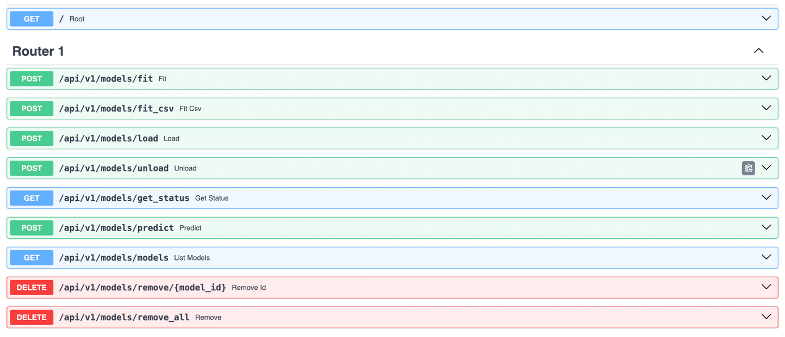

# Сервис вычисляющий вероятность наличия проблем с сердцем по данным ЭКГ

## Установка зависимостей

```bash
pip install -r requirements.txt
```

## Описание проделанной работы по подготовке предиктора:

Сервис позволяет тренировать два типа модели: LogisticRegression и SVC.
Можно передавать гиперпараметры для этих моделей.
Пока не выполняется честная валидация переданных атрибутов.

Сервис позволяет натренировать произвольное количество моделей.

## Структура репозитория:

* `./dataset/clean_data_for_training.csv` - подготовленные данные для тренировки модели. Можно отправить на вход
  эндпоинта `/api/v1/models/fit_csv`.
* `./dataset/train_for_request.json` - подготовленные данные для тренировки модели. Можно отправить на вход эндпоинта
  `/api/v1/models/fit`
* `./dataset/test_request.json` - подготовленные данные для предсказания. Передается в эндпоинт `/api/v1/models/predict`
* `./dataset/train_model.py` - скрипт для подготовки данных для тренировки модели
* `./model_trainer` - код всего сервиса.
* `./env` - переменные окружения для работы сервиса.
* `./*.pkl` - примеры обученных моделей, с которыми сервис может работать при старте уже сейчас.
* `./index.json` - словарь с доступными моделями. Можно добавлять новые через АПИ или использовать существующие.

## Запуск сервера:

Для запуска сервиса нужно выполнить команду

```bash
uvicorn main:app --reload 
```

Или можно использовать docker-compose

```bash
docker compose run
```

## Тестирование сервиса:

Swagger доступен по адресу `http://0.0.0.0:8000/api/openapi#/`


Запрос на тренировку модели в котором передается csv файл с атрибутами для модели:

```bash
curl -X 'POST' \
  'http://0.0.0.0:8000/api/v1/models/fit_csv?model_id=123&ml_model_type=svc' \
  -H 'accept: application/json' \
  -H 'Content-Type: multipart/form-data' \
  -F 'file=@clean_data_for_training.csv;type=text/csv'
```

Пример ответа:

```json
[
  {
    "message": "Model '123' trained and saved"
  }
]
```


Аналогично выполняется запрос на обучение с передачей json-а, но я не буду приводить здесь, т.к. он очень объемный:

Запрос на загрузку модеиль на инференс

```bash
curl -X 'POST' \
  'http://0.0.0.0:8000/api/v1/models/load' \
  -H 'accept: application/json' \
  -H 'Content-Type: application/json' \
  -d '{
  "id": "123"
}'
```

Ответ

```json
[
  {
    "message": "Model '123' loaded"
  }
]
```


Перед предсказанием нужно выполнить загрузку модели, если вы собираетесь ее использовать

Запрос на предсказание состояния по результату ЭКГ

```bash
curl -X 'POST' \
  'http://0.0.0.0:8000/api/v1/models/predict' \
  -H 'accept: application/json' \
  -H 'Content-Type: application/json' \
  -d '{
    "id": "123",
    "X": [
        [
            0.3775,
            0.1805,
            -0.051,
            -0.0677,
            0.0273,
            61.5556,
            108.6667,
            112.8889,
            162.4444,
            330.0,
            391.5556,
            229.1111,
            278.6667,
            561.5556,
            160.1111,
            10.1111,
            194.6667,
            401.4444,
            83.6667,
            60.3572,
            5.5667,
            8.1786,
            17.6894,
            2.1602,
            9.0,
            10.0,
            939.7778,
            16.4234,
            63.8449,
            63.8644,
            1.1166,
            62.3701,
            65.6455,
            22.2149,
            0.0,
            0.0,
            2.0,
            22.2222,
            0.224,
            0.2576,
            -0.0348,
            -1.0357,
            0.0233,
            78.0,
            99.3333,
            120.6667,
            152.6667,
            316.6667,
            394.6667,
            242.0,
            274.0,
            560.0,
            171.3333,
            6.0,
            167.0,
            388.6667,
            86.3333,
            61.1792,
            1.4142,
            3.7417,
            11.1455,
            2.8674,
            3.0,
            10.0,
            939.7778,
            16.745,
            63.8449,
            63.8652,
            1.1401,
            62.3701,
            65.7895,
            23.184,
            0.0,
            0.0,
            2.0,
            22.2222,
            63.9178,
            56.0
        ],
        [
            1.1926,
            0.4355,
            -0.101,
            -0.1612,
            -0.0096,
            90.0,
            93.3333,
            144.0,
            173.3333,
            330.0,
            420.0,
            246.6667,
            276.0,
            581.3333,
            166.0,
            17.3333,
            184.6667,
            415.3333,
            84.0,
            88.0606,
            8.0554,
            10.2089,
            10.3709,
            2.4495,
            3.0,
            8.0,
            1258.0,
            77.201,
            47.6948,
            47.8735,
            2.9151,
            43.7956,
            51.6351,
            55.6537,
            3.0,
            42.8571,
            5.0,
            71.4286,
            0.2036,
            0.687,
            -0.0292,
            -2.4195,
            0.0463,
            122.0,
            183.0,
            175.0,
            210.0,
            336.0,
            458.0,
            248.0,
            283.0,
            718.5,
            284.0,
            21.0,
            192.0,
            434.5,
            83.0,
            97.9005,
            23.184,
            36.1939,
            34.2381,
            2.9155,
            4.0,
            8.0,
            1259.4286,
            75.704,
            47.6407,
            47.8118,
            2.85,
            43.8596,
            51.6351,
            56.2257,
            2.0,
            28.5714,
            5.0,
            71.4286,
            47.5429,
            19.0
        ],
        [
            0.5028,
            0.095,
            -0.0611,
            -0.077,
            -0.0076,
            75.0,
            75.0,
            132.25,
            163.5,
            351.25,
            426.25,
            262.75,
            294.0,
            607.0,
            142.375,
            7.625,
            164.0,
            464.625,
            67.875,
            50.3536,
            7.7126,
            39.1408,
            39.2967,
            33.8432,
            8.0,
            10.0,
            940.4444,
            18.4699,
            63.7996,
            63.824,
            1.2427,
            61.6016,
            65.5022,
            15.7321,
            0.0,
            0.0,
            1.0,
            11.1111,
            0.141,
            0.1299,
            -0.0583,
            -0.6894,
            0.0288,
            59.0,
            61.25,
            115.5,
            145.25,
            333.0,
            392.0,
            246.75,
            276.5,
            626.25,
            105.625,
            14.625,
            157.125,
            520.625,
            56.25,
            40.4257,
            7.5818,
            52.0515,
            86.5794,
            46.8368,
            8.0,
            10.0,
            940.4444,
            18.8745,
            63.7996,
            63.8251,
            1.2672,
            61.4754,
            65.3595,
            15.1822,
            0.0,
            0.0,
            1.0,
            11.1111,
            63.7729,
            37.0
        ],
        [
            1.0681,
            0.1213,
            -0.053,
            -0.6106,
            0.0192,
            55.5556,
            53.7778,
            135.1111,
            166.2222,
            378.0,
            433.5556,
            267.3333,
            298.4444,
            592.8889,
            104.1111,
            5.2222,
            211.5556,
            488.7778,
            95.6667,
            17.5401,
            1.4741,
            5.9835,
            42.5775,
            4.6904,
            9.0,
            10.0,
            967.5556,
            17.4809,
            62.0119,
            62.0321,
            1.1142,
            60.241,
            63.4249,
            31.7096,
            0.0,
            0.0,
            6.0,
            66.6667,
            0.1232,
            0.3644,
            -0.093,
            -0.9357,
            0.0337,
            66.4,
            62.0,
            118.0,
            155.6,
            332.4,
            398.8,
            243.2,
            280.8,
            548.0,
            114.6,
            13.8,
            188.0,
            433.4,
            85.0,
            48.1149,
            8.4,
            14.6287,
            20.9914,
            4.6476,
            5.0,
            10.0,
            967.5556,
            18.1788,
            62.0119,
            62.0337,
            1.1566,
            60.1202,
            63.4249,
            32.9697,
            1.0,
            11.1111,
            6.0,
            66.6667,
            62.0571,
            54.0
        ],
        [
            0.6619,
            0.3282,
            -0.0987,
            -0.1801,
            -0.0401,
            122.0,
            83.4286,
            159.7143,
            199.4286,
            304.0,
            426.0,
            226.5714,
            266.2857,
            571.4286,
            185.4286,
            20.0,
            174.0,
            386.0,
            76.5714,
            44.6122,
            10.0995,
            10.198,
            10.6503,
            1.9898,
            7.0,
            10.0,
            985.7778,
            32.8288,
            60.8656,
            60.9348,
            2.0773,
            58.2524,
            65.3595,
            23.4947,
            0.0,
            0.0,
            5.0,
            55.5556,
            0.9685,
            0.3831,
            -0.1059,
            -1.5618,
            -0.0159,
            80.2222,
            64.0,
            150.6667,
            181.3333,
            324.4444,
            404.6667,
            223.3333,
            254.0,
            543.5556,
            136.0,
            8.2222,
            184.8889,
            407.5556,
            75.5556,
            32.9511,
            4.366,
            9.8595,
            12.8332,
            2.4088,
            9.0,
            10.0,
            985.7778,
            32.8152,
            60.8656,
            60.9347,
            2.0773,
            58.3658,
            65.3595,
            23.9583,
            0.0,
            0.0,
            5.0,
            55.5556,
            60.9167,
            55.0
        ],
        [
            0.6843,
            0.2489,
            -0.0661,
            -0.1733,
            -0.0099,
            88.8889,
            47.5556,
            162.4444,
            192.2222,
            304.6667,
            393.5556,
            201.3333,
            231.1111,
            501.1111,
            124.1111,
            12.3333,
            186.2222,
            377.0,
            70.5556,
            32.6988,
            14.3527,
            13.2479,
            16.09,
            2.0608,
            9.0,
            10.0,
            953.5556,
            58.384,
            62.9224,
            63.1717,
            4.0764,
            59.5238,
            71.599,
            49.1833,
            3.0,
            33.3333,
            4.0,
            44.4444,
            0.1017,
            0.3507,
            -0.0458,
            -1.1621,
            0.0288,
            90.25,
            49.25,
            140.75,
            173.5,
            293.25,
            383.5,
            210.0,
            242.75,
            508.0,
            116.875,
            22.625,
            177.25,
            391.125,
            71.375,
            26.0405,
            8.5723,
            15.7778,
            12.7714,
            2.3947,
            8.0,
            10.0,
            953.5556,
            58.7407,
            62.9224,
            63.1745,
            4.0979,
            59.5238,
            71.599,
            49.1732,
            3.0,
            33.3333,
            4.0,
            44.4444,
            63.0845,
            22.0
        ],
        [
            0.6633,
            0.2035,
            -0.0854,
            -0.2194,
            -0.0001,
            84.9091,
            43.4545,
            118.3636,
            155.6364,
            319.6364,
            404.5455,
            248.9091,
            286.1818,
            512.9091,
            119.8182,
            8.5455,
            156.8182,
            393.0909,
            77.5455,
            18.9824,
            4.6781,
            5.2539,
            13.249,
            2.9959,
            11.0,
            12.0,
            762.0,
            12.3877,
            78.7402,
            78.7611,
            1.2884,
            77.3196,
            80.8625,
            5.5498,
            0.0,
            0.0,
            0.0,
            0.0,
            0.1154,
            0.1802,
            0.0101,
            -1.0098,
            0.04,
            47.5,
            77.25,
            93.5,
            132.25,
            297.5,
            345.0,
            212.75,
            251.5,
            558.5,
            118.5,
            6.25,
            169.25,
            440.0,
            78.25,
            30.7652,
            5.5396,
            15.1719,
            8.0156,
            5.517,
            8.0,
            13.0,
            759.1667,
            14.8202,
            79.034,
            79.0645,
            1.5602,
            77.3196,
            82.1918,
            14.1807,
            0.0,
            0.0,
            1.0,
            8.3333,
            78.9427,
            58.0
        ],
        [
            0.6465,
            0.1914,
            -0.0678,
            -0.1146,
            -0.0252,
            75.6,
            68.8,
            115.6,
            148.0,
            299.6,
            375.2,
            227.2,
            259.6,
            503.6,
            130.4,
            14.0,
            169.8,
            373.2,
            83.4,
            10.1705,
            11.1893,
            11.7712,
            8.6579,
            2.245,
            5.0,
            12.0,
            807.8182,
            64.0367,
            74.2741,
            74.7427,
            5.9198,
            66.5188,
            83.7989,
            72.7516,
            7.0,
            63.6364,
            10.0,
            90.9091,
            0.1819,
            0.2407,
            -0.0321,
            -1.0028,
            0.0152,
            59.5,
            72.0,
            98.75,
            131.0,
            310.0,
            369.5,
            238.5,
            270.75,
            520.5,
            122.0,
            9.5,
            166.75,
            398.5,
            85.75,
            37.5167,
            7.433,
            14.7542,
            13.1053,
            3.7666,
            8.0,
            12.0,
            807.8182,
            64.6639,
            74.2741,
            74.7523,
            5.9821,
            66.5188,
            84.0336,
            73.4656,
            7.0,
            63.6364,
            10.0,
            90.9091,
            74.4564,
            19.0
        ],
        [
            0.7584,
            0.1584,
            -0.0659,
            -0.1644,
            -0.0055,
            85.1429,
            50.2857,
            138.0,
            172.5714,
            306.2857,
            391.4286,
            218.8571,
            253.4286,
            504.2857,
            126.7143,
            8.7143,
            174.1429,
            377.5714,
            78.0,
            13.7707,
            6.6701,
            10.7627,
            11.6724,
            1.069,
            7.0,
            9.0,
            1011.75,
            57.5885,
            59.3032,
            59.5032,
            3.5179,
            55.2486,
            65.9341,
            96.2259,
            3.0,
            37.5,
            6.0,
            75.0,
            0.5188,
            0.3227,
            -0.0882,
            -0.8382,
            -0.0019,
            87.4286,
            38.0,
            136.0,
            170.0,
            303.1429,
            390.5714,
            220.5714,
            254.5714,
            509.4286,
            116.8571,
            8.5714,
            170.5714,
            392.5714,
            79.4286,
            9.5682,
            6.3213,
            9.0531,
            7.8532,
            0.9035,
            7.0,
            10.0,
            979.5556,
            107.0359,
            61.2523,
            62.1433,
            8.2142,
            55.2486,
            83.3333,
            118.7455,
            4.0,
            44.4444,
            7.0,
            77.7778,
            60.4928,
            17.0
        ],
        [
            0.6958,
            0.268,
            -0.0901,
            -0.0913,
            -0.0439,
            83.3333,
            73.3333,
            133.3333,
            168.0,
            278.6667,
            362.0,
            194.0,
            228.6667,
            491.3333,
            145.3333,
            11.3333,
            168.3333,
            346.0,
            72.3333,
            28.9406,
            3.2998,
            5.7349,
            8.5245,
            1.2472,
            3.0,
            11.0,
            831.8,
            58.4291,
            72.1327,
            72.499,
            5.2249,
            65.7895,
            81.9672,
            52.2983,
            5.0,
            50.0,
            9.0,
            90.0,
            0.0995,
            0.546,
            -0.0733,
            -1.0887,
            0.0102,
            71.4,
            30.8,
            117.2,
            151.0,
            284.6,
            356.0,
            205.0,
            238.8,
            457.4,
            83.9,
            18.3,
            171.5,
            373.5,
            73.6,
            5.3749,
            6.4506,
            5.0448,
            4.8836,
            0.4899,
            10.0,
            11.0,
            832.2,
            58.818,
            72.0981,
            72.4688,
            5.2568,
            65.6455,
            81.9672,
            52.6751,
            5.0,
            50.0,
            9.0,
            90.0,
            72.0623,
            19.0
        ]
    ]
}'
```

Пример ответа:

```json
{
  "predictions": [
    {
      "label": "NORM",
      "probability": 0.8446448645258282
    },
    {
      "label": "NORM",
      "probability": 0.8747584608797849
    },
    {
      "label": "NORM",
      "probability": 0.7195846052778788
    },
    {
      "label": "PROBLEM",
      "probability": 0.6071147791942257
    },
    {
      "label": "NORM",
      "probability": 0.9438379204124739
    },
    {
      "label": "NORM",
      "probability": 0.9405155669563573
    },
    {
      "label": "NORM",
      "probability": 0.9063102216131681
    },
    {
      "label": "NORM",
      "probability": 0.8839106929708677
    },
    {
      "label": "NORM",
      "probability": 0.9384177655116449
    },
    {
      "label": "NORM",
      "probability": 0.9270967580563095
    }
  ]
}
```


Запрос на получение списка моделей

```bash
curl -X 'GET' \
  'http://0.0.0.0:8000/api/v1/models/models' \
  -H 'accept: application/json'
```

Ответ

```json
[
  {
    "models": [
      {
        "id": "111",
        "type": "logic"
      },
      {
        "id": "123",
        "type": "svc"
      }
    ]
  }
]
```


Загруженные модели на инференс можно выгрузить из памяти.
Так же можно физически удалить ранее обученные модели, передав id модели в эндпоинт
`/api/v1/models/remove/{model_id}`

Пример

```bash
curl -X 'DELETE' \
  'http://0.0.0.0:8000/api/v1/models/remove/123' \
  -H 'accept: application/json'
```

Ответ

```json
[
  {
    "message": "Model '123' removed"
  }
]
```

Streamlit и логгирование реализовать не успели. Сделаем уже ближе к дате предзащиты.

